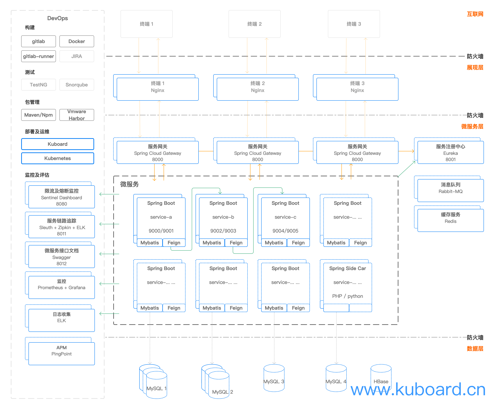
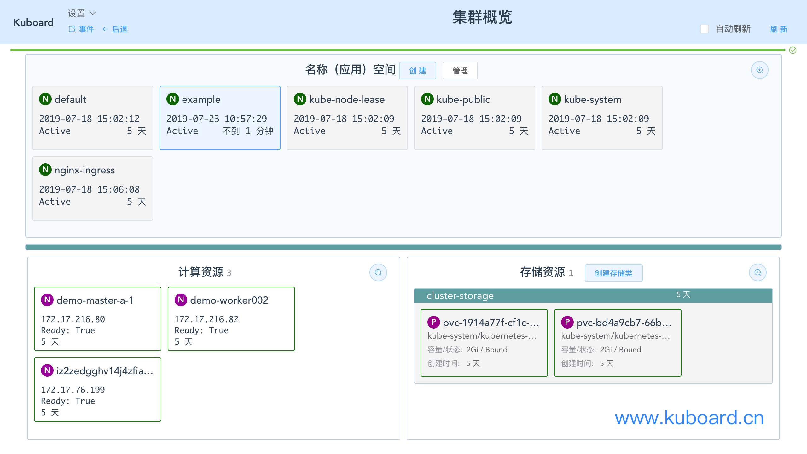
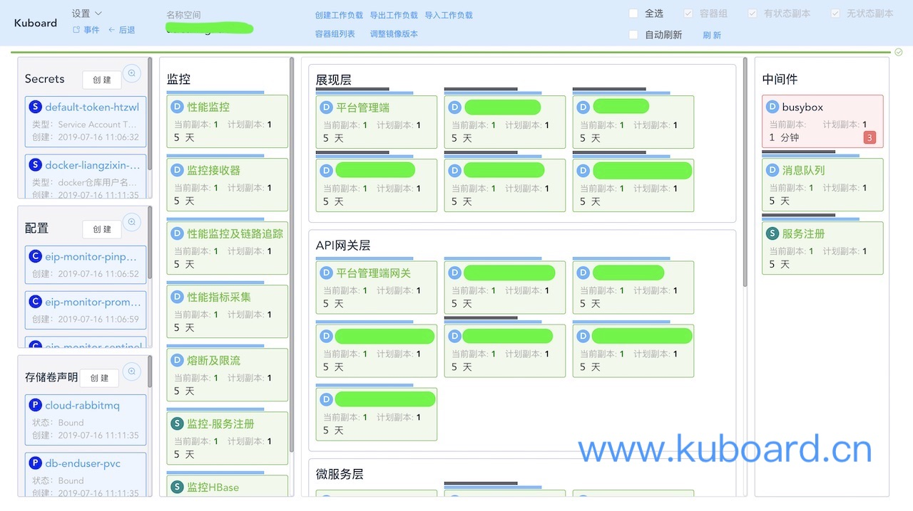
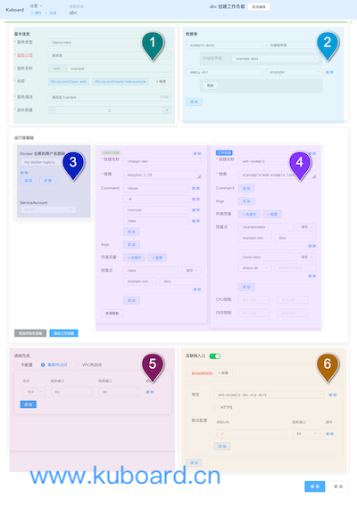
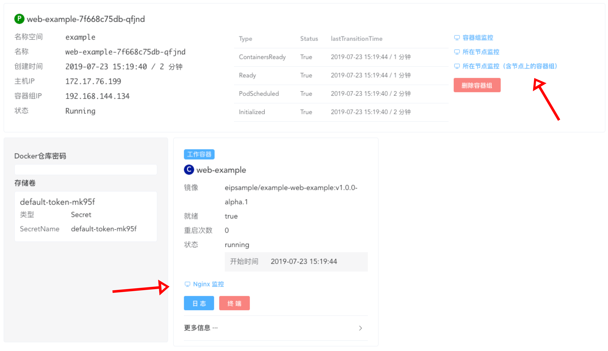

# 从微服务视角看 Kubernetes

## 微服务

当我们谈论微服务的时候，总避免不了说 Spring Cloud / Dubbo，这些微服务架构的采用，确实达到了我们对他的期许：分布式、熔断/限流、高可用、可扩展、分离关注、链路追踪、小团队快速迭代。

然而，微服务架构的引入在解决单体应用的一些问题的同时，也给我们带来了新的复杂度：
* 更多的技术组件
* 更多的部署单元
* 更复杂的部署脚本

作者在落地 Spring Cloud 微服务的过程中，设计了如下图所示的微服务参考架构：

该图的左侧是 DevOps 平台，涵盖构建、测试、包管理、部署及运维、监控及评估。右侧是运行时平台，分成互联网层、展现层、微服务层、数据层。

### 运行时环境：

* 展现层主要是前端项目（Vue、微信小程序等），通过服务网关的路由调用微服务层 SpringBoot 实现的各种业务接口；一个大型互联网产品中，需要多少个展现层的前端项目主要取决于两个因素：该产品有多少中类型的参与方、每一种参与方各有多少种渠道接入方式。例如，某交易撮合平台，其需要的展现层项目如下列表所示：

  | 参与方     | 渠道       | 展现层项目       |
  | ---------- | ---------- | ---------------- |
  | 散客 | PC浏览器   | 官网       |
  |            | 移动站     | 移动站     |
  |            | 微信小程序 | 微信小程序 |
  |            | App        | APP        |
  | 大客户     | PC浏览器   | VIP客户端  |
  | 平台方     | PC浏览器   | 运营工作台 |
  | 供应商     | 微信小程序 | 接单工具   |
  |            | APP        | 接单APP    |

  展现层项目由于参与方不同，账号体系也就不同，因此，鉴权授权的逻辑也有较大的差异，基于这样的考虑，我们为不同的展现层项目各自部署对应的接入网关 Spring Cloud Gateway。

* 微服务层的项目包括 Spring Cloud Gateway 的主要组件，例如：服务注册 Eureka、服务网关 Spring Cloud Gateway、实现微服务的 Spring Boot项目，还有一些服务层用到的中间件（消息队列 Rabbit MQ、缓存服务 Redis等）

  服务层里，项目数量最多的类型是实现微服务的 Spring Boot 项目。使用微服务架构，如何将单体应用的各个模块拆分成多个微服务单元，一直一个大家很关注却未能深入探讨的问题。作者设计过多个微服务系统的架构之后，认为，一个合理的服务拆分方式是以领域驱动设计的结果作为参考，可以将每一个领域的上下文边界对应为一个微服务单元。如此一来，在使用服务网关隔离的前后端分离的微服务架构中，前端微服务划的分重要依据是参与方类型 + 接入渠道，后端微服务划分的重要依据是领域设计的上下文边界。

  作为一个完整的交易撮合平台，涉及到的业务领域较为庞大，涉及到数十个业务问题领域。合理拆分的微服务架构，可以使得企业对不同的问题领域分而治之。

### DevOps平台

运行时环境采纳了微服务架构后，因为技术组件的多样性、业务领域的多样性，导致了微服务拆分之后，产生了数十个微服务可部署单元。这个情况给技术团队带来了前所未有的挑战：

* 构建次数多，人工难以完成

* 部署实例多，无法人工管理
* 运行实例多，出了故障不好定位

在解决这些问题的过程中，最终摸索出了一套以 Kubernetes 为关键环节的微服务 DevOps 平台。

如上图所示，假设有20+ 开发人员，

* 每天提交100次代码，将每天产生100余次构建和自动测试，新增80-100个 docker 镜像
* 每天更新开发环境、测试环境各一次，每次重新部署20+ 个 docker container
* 每周更新 STAGING 环境 3-4次，每周更新 PRODUCTION 环境 1-2 次

在单体应用的时候，即使是手工打包也是能够完成每天发布新版本的要求的。但是在微服务环境下，这个工作就必须交给 DevOps 的 Pipe Line 来完成。

DevOps 在构建阶段的主角是 GitLab、npm、maven、docker、Harbor等工具集，在部署和运维环节的主角就是Kubernetes了。

## 微服务 + Kubernetes

最开始尝试容器化的时候，使用了 docker、docker-compose，但是docker-compose的编排能力有限，在考虑分布式方案时，从 docker swarm、kuberenetes 之中选择了 Kubernetes，然而，Kubernetes 相较于 docker-compose，有一个很高的学习门槛，集群的安装管理、YAML 文件的编写、多环境（开发环境、测试环境、准生产环境、生产环境）的配置、分布式环境下的问题诊断和性能优化等，一系列的问题需要解决，团队中也出现一些抵触情绪，对新事物持观望的态度。

Kubernetes在诸多大厂的成功实施，仍然让我们坚信这条道路的正确性。为了解决 Kubernetes 学习门槛高、YAML 文件编写复杂等一系列现实中的困难，我们研发了 Kuboard，一款 Kubernetes 的图形化管理控制工具。

Kuboard 诞生于 Spring Cloud 微服务落地的实践过程中，他在管理和使用 Kubernetes 的时候，也更多地是从微服务的视角来看待 Kubernetes。

具体体现在如下三个视角：

* 集群概览
* 名称空间
* 工作负载

### 集群概览

从管理和部署微服务的视角来看，微服务应用是分布式应用，应该部署在一个分布式集群当中，这个集群由诸多计算资源和存储资源组成，微服务本身不应该关心最终使用了哪个计算节点，持久化存储被存放在什么位置；为了更好地利用资源，一个集群应该被划分成多个名称空间，每个名称空间内可以部署一整套微服务应用，名称空间之间不应相互干扰。

如下图所示：***Kuboard 集群概览界面***

Kuboard 集群概览视角，映射了 Kubernetes 中的如下几个重要概念：

* Cluster
* Node
* Storage Class / Persistent Volume
* Namespace

### 名称空间

在集群概览界面中，点击一个名称空间，可以进入Kuboard名称空间界面。一个名称空间内部，是微服务部署相关的所有重要元素。与本文开头的微服务参考架构相匹配，Kuboard 认为，微服务的主要分层包括：

* 展现层
* 网关层
* 服务层
* 持久层
* 中间件层
* 监控层

如下图所示：***Kuboard名称空间截图***

Kuboard 名称空间视角，映射了 Kubernetes 中的如下几个重要概念：

* Workload（Deployment、StatefulSet、DaemonSet）
* Service（微服务上方如果有浅蓝色长条块，说明该微服务有配置 Service）
* Ingress（微服务上方如果有黑色短条块，说明该微服务有配置 Ingress）
* Secrets（用来配置私有 docker 镜像仓库的用户名密码、HTTPS 的证书等信息，可在创建微服务 Workload 时引用）
* ConfigMap（配置，用来存储配置信息，可定义微服务的公共环境变量，并在创建微服务 Workload 时引用）
* Persistent Volume Claim（存储卷声明，用来声明存储卷，可在创建微服务 Workload 时引用）

Kuboard 名称空间界面中，还为典型的运维场景提供了便捷的操作入口，例如：

* 创建工作负载（通过工作负载编辑器完成微服务应用的部署，而不是编写冗长的YAML文件，再使用复杂的 kubectl 命令）
* 导出工作负载（选择名称空间中的微服务元素，导出到一个文件中）
* 导入工作负载（将 Kuboard 导出的 YAML 文件导入到一个新的名称空间中，通过导出和导入的功能，用户可以快速的将开发环境复制成测试环境）
* 容器组列表（查看当前名称空间中的容器组，可批量删除选中容器组，删除容器组后，Kubernetes将重新 Schedule一个容器组以替换被删除的容器组，此时将重新抓取镜像，此特性可用于测试环境中在 image tag 不改变的情况下的版本更新）
* 调整镜像版本（修改容器镜像的标签，此特性用于在正式环境中进行版本更新的操作）
* 高亮显示包含错误事件的微服务（如截图中红色的微服务 busybox）

### 工作负载

从名称空间界面中点击一个工作负载（微服务），可进入 Kuboard 工作负载编辑器界面。Kuboard 当前已经支持的工作负载 Workload 类型有：Deployment / StatefulSet / DaemonSet。

Kubernetes 中，与 Workload 相关的概念非常多，Kuboard 从微服务部署的实际需要出发，按照下图所示的方式理解这些相关概念：

Kuboard 工作负载视图中，关联的 Kubernetes 中如下几个重要的概念：

* Label / Label Selector
* Workload Controller 工作负载控制器（Deployment / StatefulSet / DaemonSet）
* Volume 数据卷
* ImagePullSecrets （Docker 仓库用户名密码，用于访问私有 docker  镜像仓库）
* ServiceAccount
* Container 容器
* Service 访问方式
* Ingress 互联网入口

Kuboard 认为，掌握这些概念并正确理解这些概念的关系之后，就可以胜任使用 Kubernetes 部署微服务的工作，为了使事情变得更简单，避免编写冗长的 YAML 文件，Kuboard 以此概念为基础，设计了 Kuboard 工作负载编辑器，如下图所示：

## 微服务 + 监控/评估

如何监控和评估微服务的运行状况，并根据监控结果进行问题的定位和诊断？基于 Kubernetes / Spring Cloud / Java 等，开源社区已经提供了非常丰富的监控组件，例如：

* 资源层监控：Prometheus + Grafana + Node Exporter 等组件，监控Kubernetes 节点的 CPU、内存、网络、磁盘等使用情况
* 中间件层监控：Prometheus + Grafana + MySQL Exporter + Nginx Exporter + JVM Exporter 等，监控 MySQL、Nginx、JVM 等中间件的使用情况
* 链路/APM监控：Pinpoint / SkyWorking 等监控工具，监控应用程序的性能表现

各种监控系统各有侧重，如果想要取得比较好的监控效果，必须克服如下几个困难：

* 搭建和配置监控系统
* 定位和诊断问题时，在不同监控系统中来回切换，进入监控系统并寻找对应微服务的监控结果

Kuboard 认为，应该以微服务视角的视角快速查看到该无服务在不同层面的监控结果。因此，在 Kuboard 的工作负载（微服务）查看界面中，可以直接点击进入不同监控系统对应的监控结果，无需再监控系统内反复查找。如一下截图所示：

点击图中 ***Nginx 监控***、 ***容器组监控***、 ***所在节点监控*** 等按钮，可以直接打开该容器组对应的监控界面。因为篇幅的限制，此处不再展开描述，请点击 <a target="_blank" :href="`http://demo.kuboard.cn/#/login?isReadOnly=true&token=${$site.themeConfig.kuboardToken}`">
  Kuboard 在线体验
</a> 查看具体的监控效果。

## 总结

Kuboard 产生于 Spring Cloud 微服务落地的实践中，并在许多的实际项目中投入了使用，以微服务的视角理解和审视了 Kubernetes，并基于Kubernetes为用户提供了4个微服务视图：

* 集群概览视图
* 名称空间视图
* 工作负载视图
* 监控视图

目前 Kuboard 已经可以免费供大家使用，感性的朋友可访问 www.kuboard.cn 获得详细的信息。

