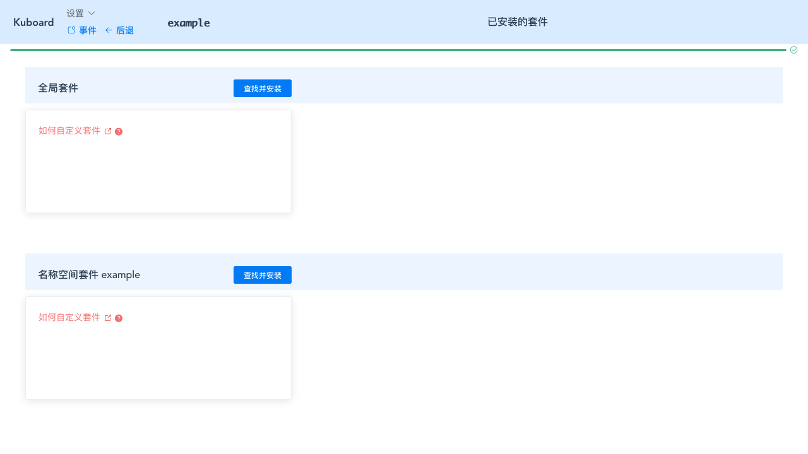
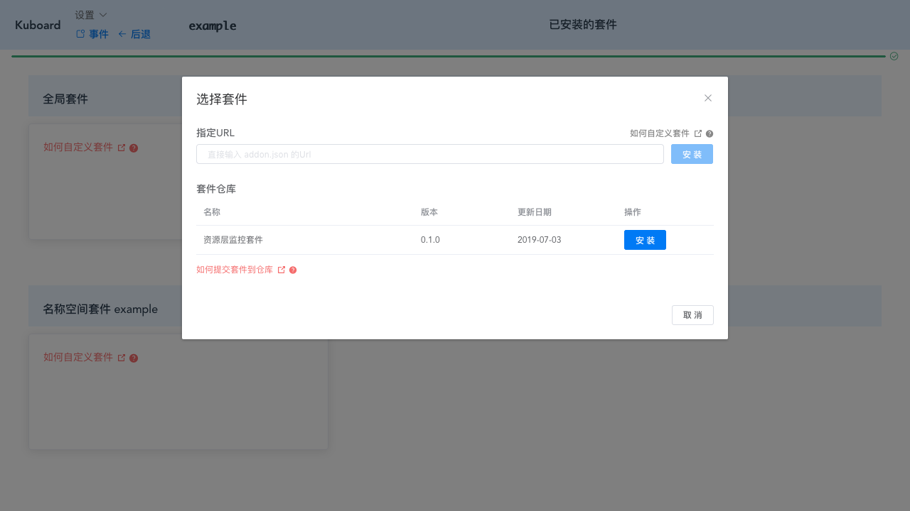
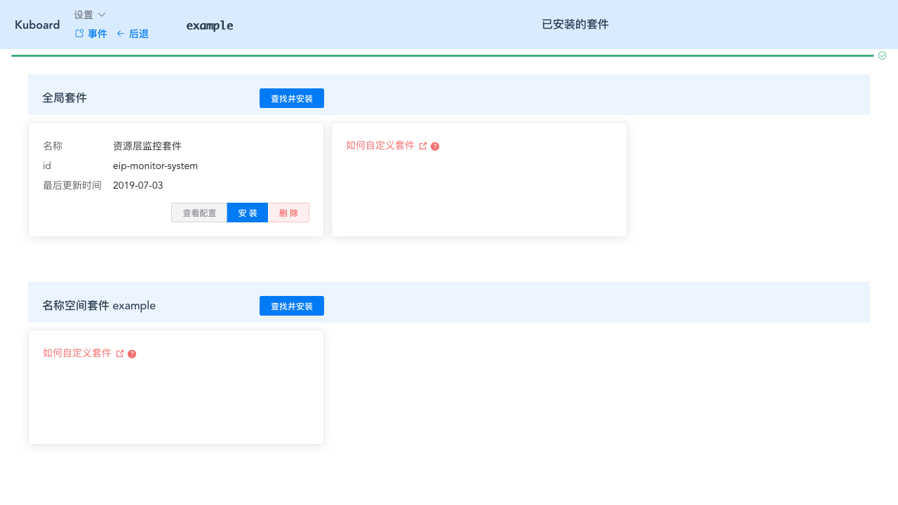
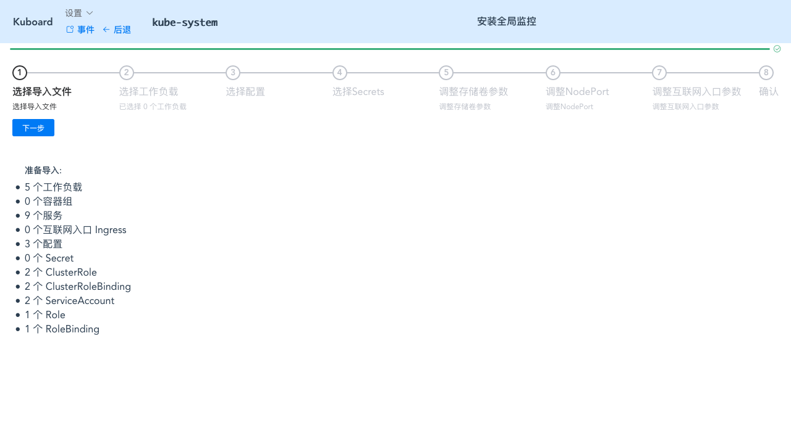
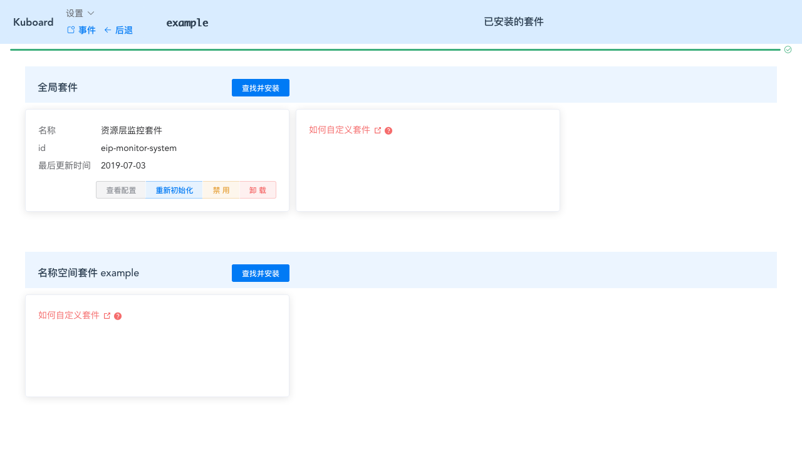
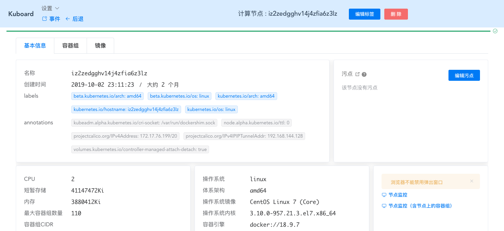
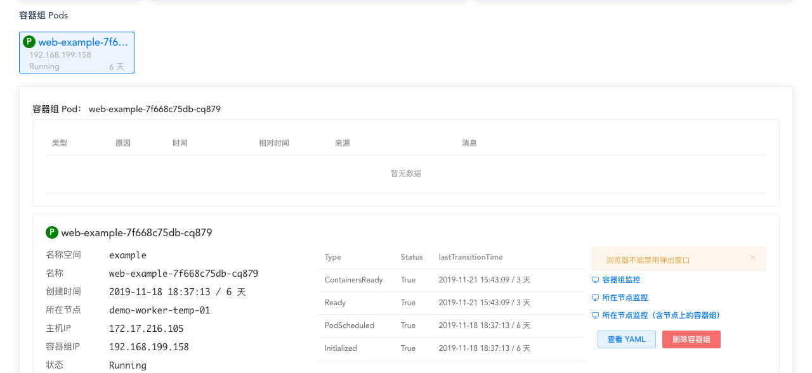

# Kuboard套件

<AdSenseTitle/>

## 概述

目前比较流行的 Kubernetes 包管理器是 helm，其仓库中已经拥有了许多的 helm chart。Kuboard 套件并无意成为另外一个包管理器，设计的出发点是为了在 Kuboard 界面中提供基于应用程序上下文的监控查看、日志查看等特性。

具体应用请参考 [监控 example](/guide/example/monitor.html)

## 特点

Kuboard套件具备如下特点：
* 快速安装
  * 从套件仓库获得套件的配置文件
  * 利用Kuboard已经提供的导入功能，可以完成套件安装
* 初始化
  * 许多应用安装完成后需要执行初始化动作才能正常使用，例如 grafana 要配置其 DataSource 和 dashboard
  * Kuboard套件的作者可以将初始化动作固化到套件的脚本中
* Kuboard界面上下文
  * 套件可以在如下几个层级向Kuboard预留的位置添加按钮，Kuboard会将上下文作为参数调用套件的回调函数
    * 节点Node
    * 容器组Pod
    * 容器Container
* 卸载
  * 可以在Kuboard界面中方便地卸载已经安装的套件
* 新增自定义套件
  * Kuboard套件的API已经开放，可以根据自己的需要创建套件，或者在已有套件基础上修改为更加符合自己需要的套件

## 类型

Kuboard套件可以分为：
* 全局类型
  * 安装到 kube-system 名称空间
  * 全局套件定义的按钮将对所有节点，所有名称空间中的 Pod、Container 生效
* 名称空间类型
  * 安装到指定名称空间
  * 名称空间套件定义的按钮只在指定的名称空间生效

## 安装套件

* 在名称空间点击 **套件** 按钮，如下图所示：

  

  将进入已安装的套件列表界面，如下图所示：

  

* 点击 ***查找并安装*** 按钮 （此处以全局套件的安装为例），如下图所示

  

* 点击 ***资源层监控套件*** 的 ***安装*** 按钮

  > 如果您有自定义套件，也可以直接指定套件对应的 addon.json 的 URL 路径，然后点击安装，请参考 [自定义套件](./customize.html)

  此时，Kuboard已经将该套件的所有配置信息存储到 `kube-system/eip-monitor-system` 的 ConfigMap 中。如果安装的是名称空间套件，则存储在对应名称空间的 ConfigMap 中，例如 `<namespace>/<addon-id>`

  > 点击套件的 ***查看配置*** 按钮，可以在真正执行安装前，根据自己的需要修改配置

  

* 点击 ***资源层监控套件*** 的 ***安装*** 按钮

  > 此时，Kuboard 开始根据 ConfigMap 中的配置信息导入套件所需要的 Kubernetes 资源，请参考 [自定义套件](./customize.html)

  

  根据界面提示，完成套件所需 Kubernetes 资源的导入，可参考 [导入 example 微服务](/guide/example/import.html)

  完成导入后，回到 ***已安装的套件*** 界面，显示如下所示：

  

* 点击 ***初始化*** 按钮

  ::: danger 初始化的时机
  安装套件时，根据套件的实际情况，导入了不同类型不同数量的 Kubernetes 资源，其中通常有 Deployment / StatefulSet 等控制器。全局套件的资源被导入到 `kube-system` 名称空间，名称空间套件的资源被导入到当前名称空间中。在执行初始化之前，请确保这些导入的控制器已经正常运行，否则初始化将会失败。
  :::

  套件完成初始化。

   

## 使用套件

* 完成 ***初始化*** 之后，必须刷新 Kuboard 界面，套件向 Kuboard 中加入的按钮才能显示出来，以前面安装的全局监控套件为例，该套件向所有的 Node 增加了两个按钮（节点监控、节点监控-含节点上的容器组），如下图所示：

  

  向所有的 Pod 增加了三个按钮（容器组监控、所在节点监控、所在节点监控-含节点上的容器组），如下图所示：

  

* 点击 ***节点监控*** 按钮，将打开 grafana 界面，如下图所示：

  ::: tip 注意
  * Kuboard 提供了三个插入点使套件可以向 Kuboard 增加功能（节点界面、容器组界面、容器界面），具体每个套件向 Kuboard 添加了什么样的功能按钮，由该套件决定
  * 本例中的点击 **节点监控** 按钮后，Kuboard 将调用 ***资源层监控套件*** 中对应的 javascript 脚本，打开的 grafana 界面，也是由 ***资源层监控套件*** 安装到 Kubernetes 中
  :::
  
  

## 卸载套件

* 在 **已安装的套件** 列表界面，点击对应套件的 ***卸载*** 按钮，就可以将该套件卸载

## 自定义套件

Kuboard 套件的设计主要是如下两个目的：
* 将监控、日志等功能从 Kuboard 界面中分离，使得其可以独立维护
* 适应多样性的需求，例如：
  * 对中间件层的监控，如 mysql / nginx / jvm 等
  * 对链路层的监控，如 pinpoint / skywalking / zabbix 等
  * 不同形式的日志套件选择，如 EFK / ELK 等

请参考 [自定义套件](./customize.html) 了解如何实现自己的 Kuboard 套件。
