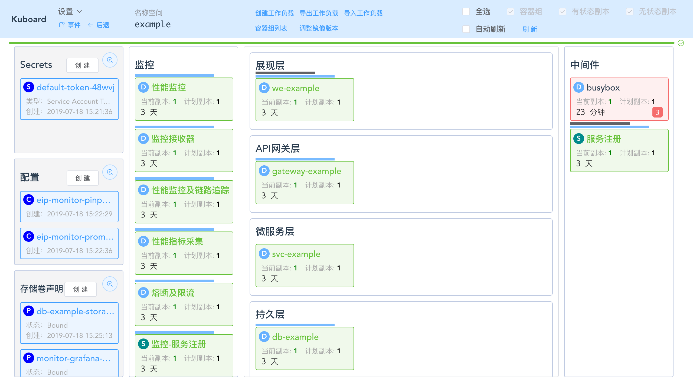
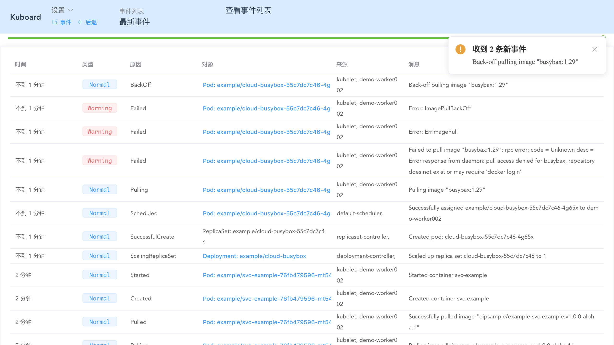
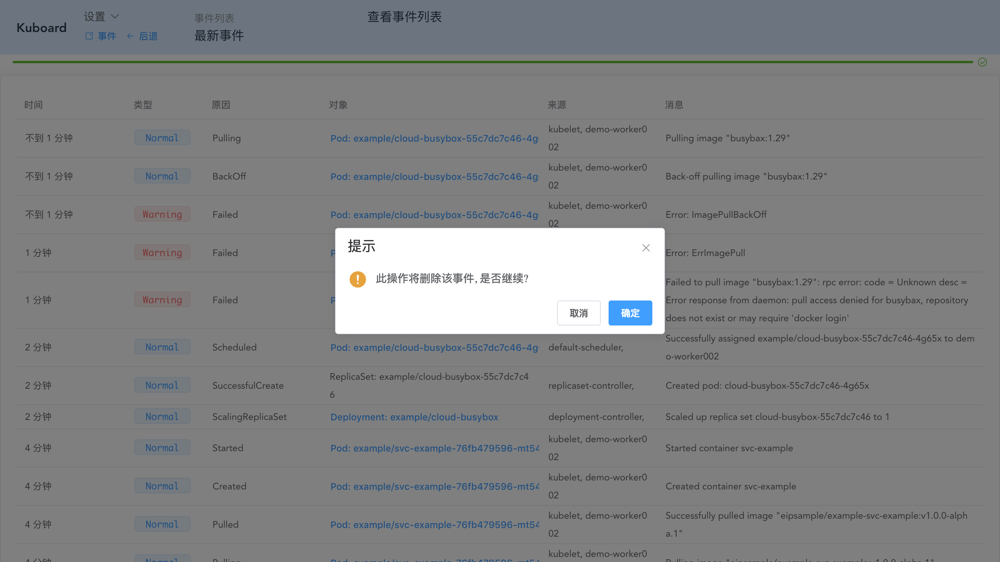
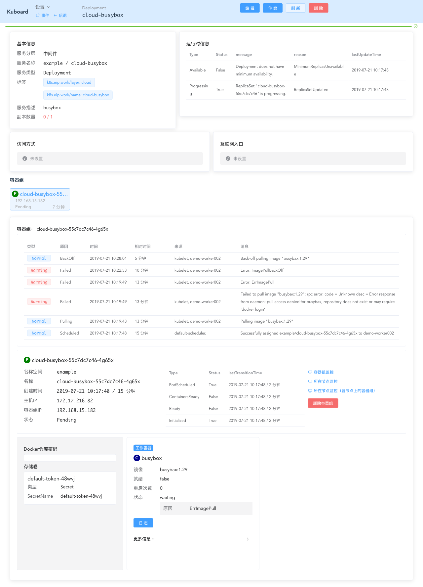

# 集群事件

<AdSenseTitle/>

通过观察 Kuberetes 集群事件，可以快速诊断部署时发生的问题。

Kuboard 建立了与 kubernetes apiserver 的长连接，可以在第一时间将集群中的事件更新以通知的形式显示在 dashboad 上。

## 错误事件提示

如果存在与某一个工作负载相关的错误事件，名称空间界面中，将以红色显示该工作负载，如下图所示：

## 全局事件

### 查看全局事件

在任何页面点击界面左上角的 ***事件*** 按钮，进入事件列表页：

### 删除事件

* 点击全局事件列表中的 ***类型*** 标签，

* 点击 ***确定***

该事件已删除。如果事件对应的错误原因没有被解决，该事件又会在下一次 kubernetes 调度系统资源的时候重新出现。

## 微服务上下文相关的事件

打开工作负载页面，如下图所示：

容器组信息中包含了与该容器组相关的所有集群事件。

