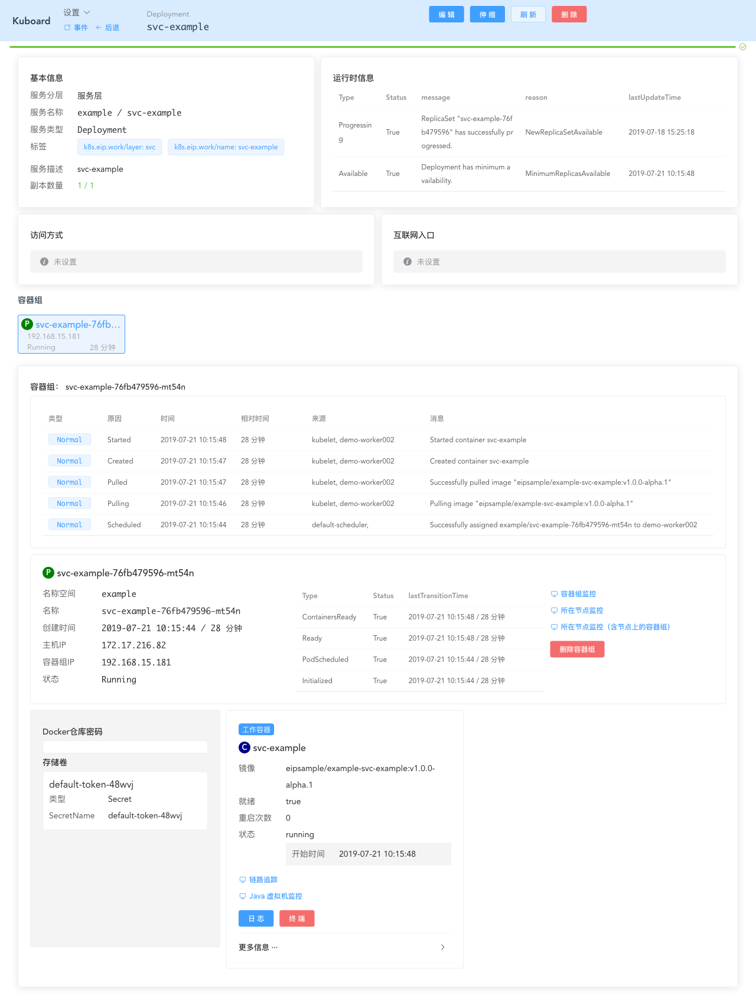
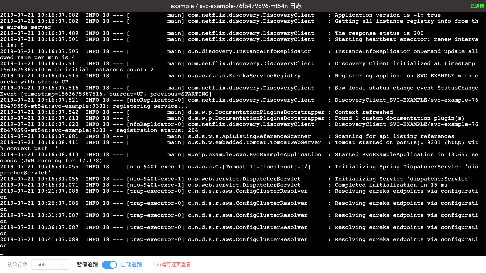
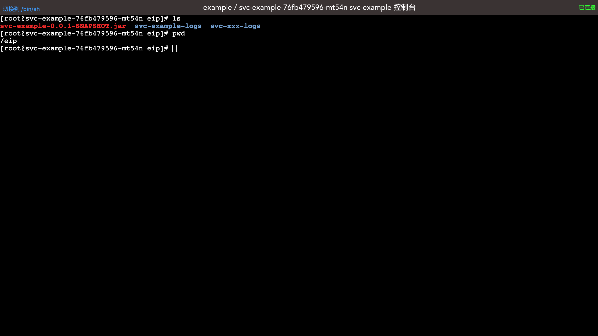

# 日志及终端

<AdSenseTitle/>

# 日志

通过 Kuboard 可以实时跟踪容器的日志信息。

假设您已经进入 ***工作负载*** 详情页，如下图所示：

* 点击容器信息中的 ***日志*** 按钮

  可进入日志追踪界面，如下图所示：

# 终端

* 点击容器信息中的 ***终端*** 按钮

  可进入终端界面，如下图所示：

  > * 在终端中，可以执行的 shell 命令取决于该容器预装的命令。许多容器为了精简自身的大小，只保留了最基本的命令。
  >
  > * 通常会进入终端执行如下诊断操作：
  >   * export 命令查看容器内的环境变量是否被正确设置
  >   * ping, curl 命令检查容器内与集群内其他服务，集群外服务的网络连通性
  >   * vi 命令，临时修改容器内应用程序的配置，并在容器内重启应用程序，以临时性的尝试修复问题，如果有效再将修改更新到应用程序代码或者 Dockerfile

