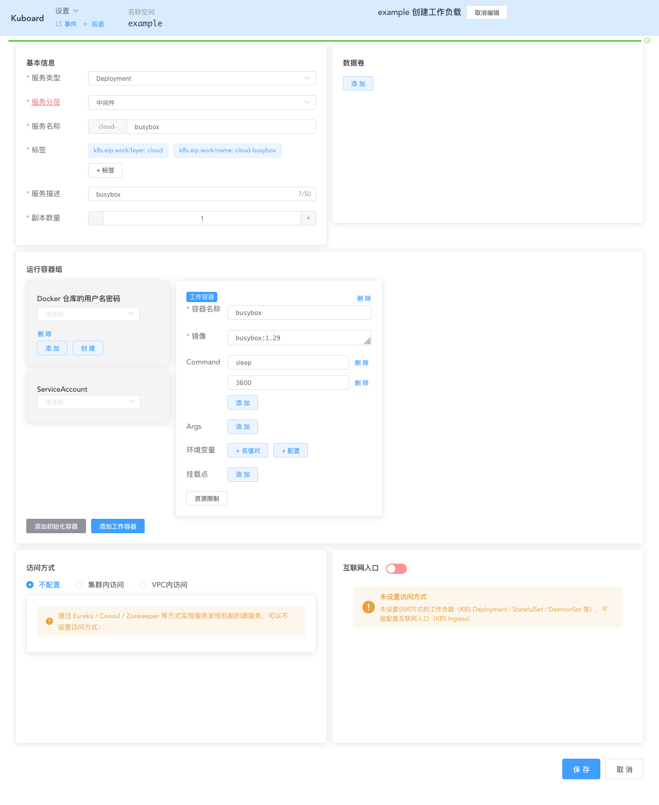
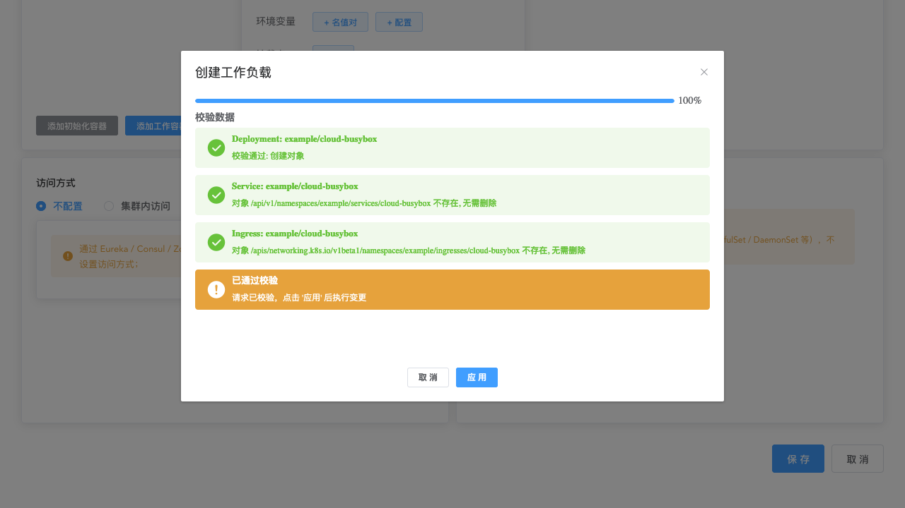
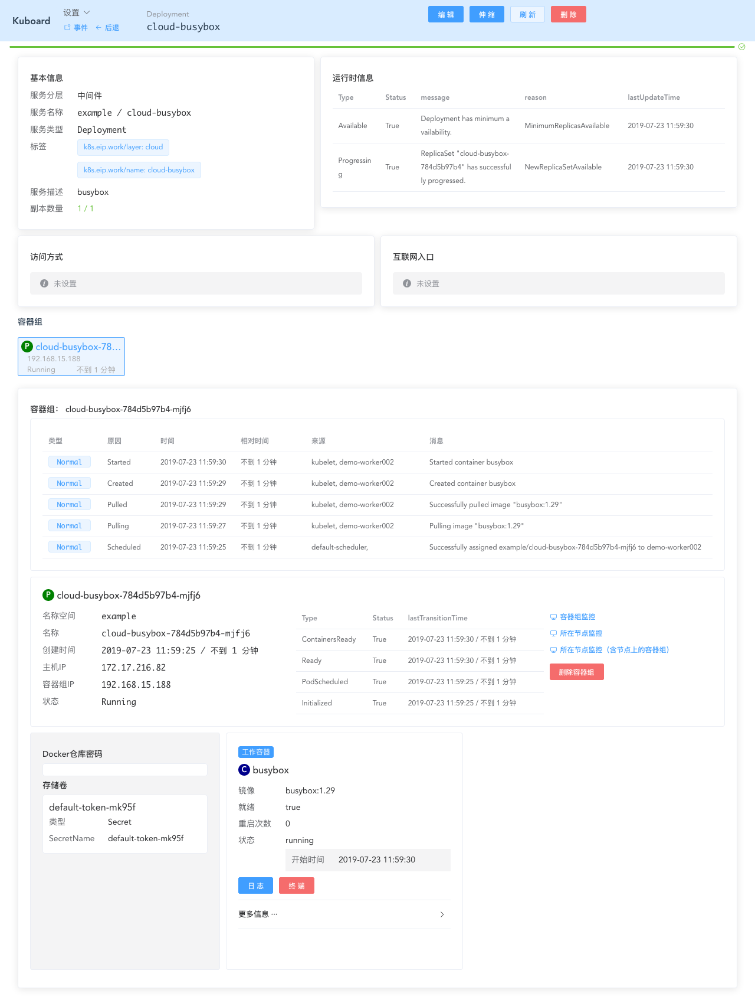
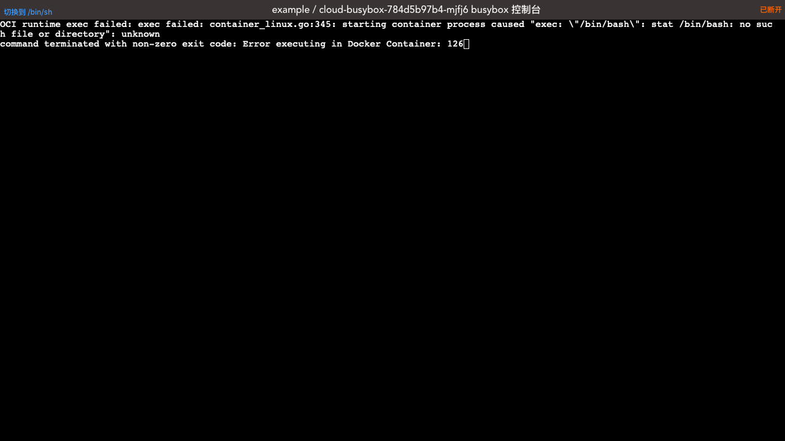
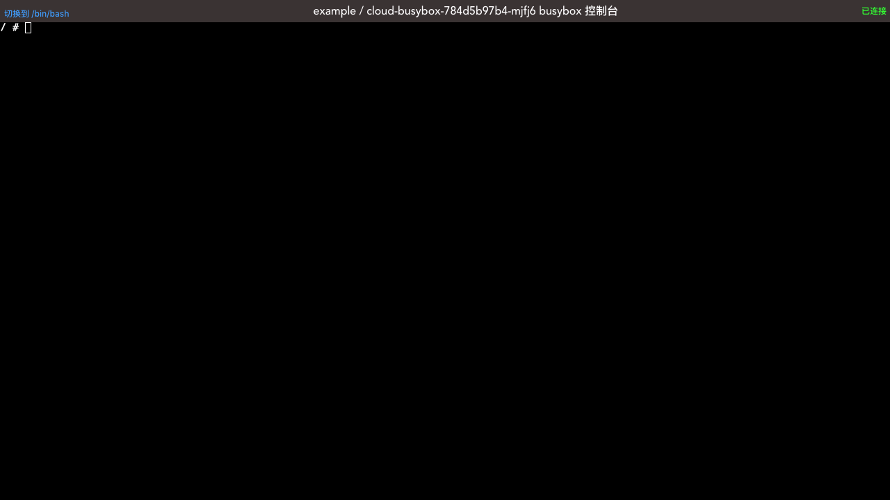
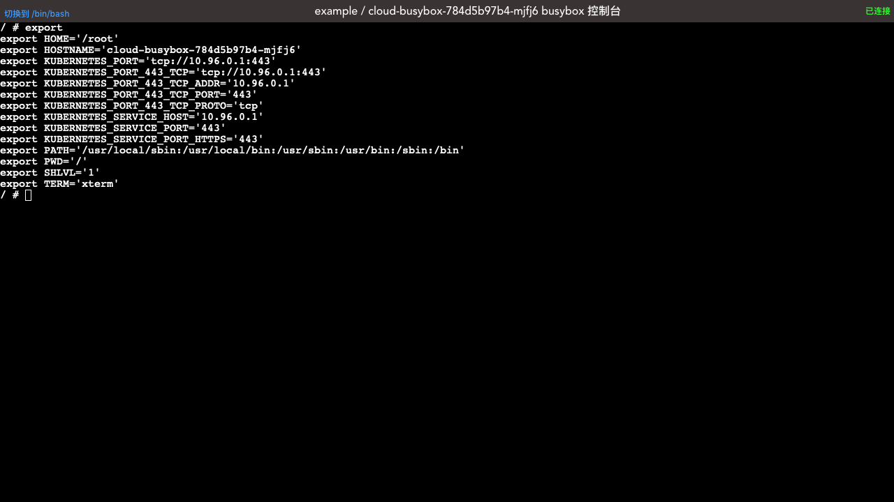

# 部署 busybox

## 前提

必须具备如下条件：

* Kubernetes 集群
* 已在集群中安装 Kuboard

假设您已经进入了 Kuboard 名称空间界面，如下图所示。可参考 [创建名称空间](/guide/cluster/namespace.html#创建名称空间)

## 部署 busybox

[查看 busybox 介绍](https://hub.docker.com/_/busybox)

Busybox 是一个非常小巧（不到5M）的容器，此处用它来展示如何将一个 docker image 通过 Kuboard 部署到 kubernetes 集群中。

* 点击 ***创建工作负载按钮***

  填写表单如下：

| 字段名称 | 填写内容     | 说明                                                         |
| -------- | ------------ | ------------------------------------------------------------ |
| 服务类型 | Deployment   | Kubernetes 的 Deployment 类型                                |
| 服务分层 | 中间件       | 生成的Kuberenetes对象以 cloud- 作为前缀， 并显示在中间件分层中 |
| 服务名称 | busybox      | 显示在 Kuboard 中的名称                                      |
| 副本数量 | 1            | replicas                                                     |
| 容器名称 | busybox      |                                                              |
| 镜像     | busybox:1.29 | hub.docker.com 中的 busybox 镜像                             |
| Command  | sleep        |                                                              |
| Command  | 3600         |                                                              |

* 完成表单填写后，点击 ***保存***

  Kuboard 将对表单参数进行校验，通过后，方可执行对集群的变更操作。

* 点击 ***应用***

  Kuboard 执行对集群的变更操作，变更的过程中，产生的事件以通知消息的形式显示出来。

## 验证工作负载

* 点击 ***完成***

  点击完成后，可查看工作负载的信息。该界面分成四个区域：

  * 页头区

    页头区包含对该工作负载（本案例中为 Deployment）的操作按钮。可执行的操作有：***编辑*** / ***伸缩*** / ***刷新*** / ***删除***

  * 工作负载基本信息

    基本信息区显示了工作负载的 ***基本信息*** 、***运行时信息***、***访问方式***（Service）、***互联网入口***（Ingress）

  * 容器组列表

    容器组列表区显示了该当前对应的所有容器组（Pod），容器组列表区监听集群的动态变化，当您执行伸缩操作、或者删除容器组操作时，无需刷新，就可以查看到最新的容器组信息。

  * 容器组详情

    容器组详情区显示了当前选中容器组的信息，其中包括：

    * 容器组相关事件
    * 容器组基本信息，及删除容器组的操作按钮。（此区域还包括容器组相关的监控操作，监控模块在后续的章节中介绍）
    * 容器基本信息，及查看容器日志、打开容器终端的按钮。（此区域还包括容器相关的监控操作，监控模块在后续的章节中介绍）

* 点击 ***终端***

  此时打开了该容器的控制台，Kuboard 默认使用 /bin/bash 终端程序，而 busybox 镜像中并不包含 /bin/bash，因此您会看到一个如下图所示的错误提示：

* 点击 ***切换到 /bin/sh***

  点击屏幕左上角的 ***切换到 /bin/sh***

* 输入 *export* 并回车

  输入 *export* 并回车后，可查看该容器当前的环境变量。您也可以在终端中执行任何容器内部的命令。在您完成容器的部署之后，终端界面是非常有效的问题诊断工具之一。

