# 导入 example 微服务

## 前提

必须具备如下条件：

* Kubernetes 集群 （安装在阿里云，本文将使用阿里云的 NFS 服务作为存储资源，Kuboard 也可以运行在其他云环境或者私有环境中。）
* 已在集群中安装 Kuboard

## 创建存储资源

example中用到了存储卷声明，请在 Kuboard 中 [创建存储类](/guide/cluster/storage.html?id=创建存储类) ，否则不能完成 example 的导入操作。

## 创建名称空间

创建新的名称空间，用来导入 exmaple。可参考 [创建名称空间](/guide/cluster/namespace.html?id=创建名称空间)

假设您已经进入了 Kuboard 名称空间界面，如下图所示：

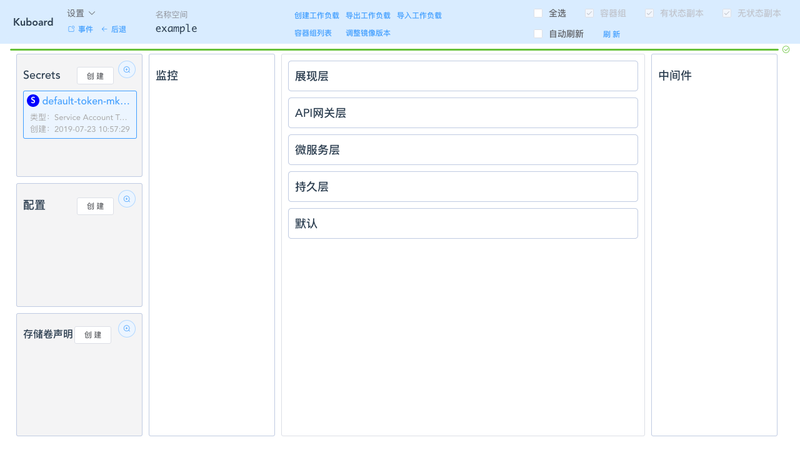

## 导入 example

* 下载 <a :href="$withBase('/kuboard_example.yaml')" download="kuboard_example.yaml">kuboard_example.yaml</a> 文件

::: tip
在 Kuboard 中，您无需手写 yaml 文件，此 yaml 文件的内容生成步骤如下：
* 通过 [创建工作负载](busybox) 完成微服务应用的部署
* 通过 [导出工作负载](/guide/namespace/multi-env.html#导出配置) 将名称空间中的微服务配置导出到一个 yaml 文件中
:::

* 点击 ***导入工作负载*** 按钮

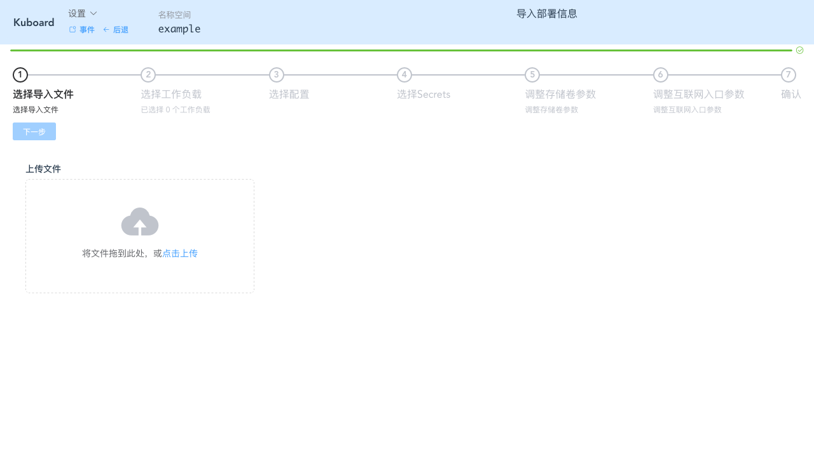

* 点击 ***上传文件*** 按钮

  并选择刚才下载的 export_example.yaml 文件


* 点击 ***下一步*** 

  默认选择所有的工作负载

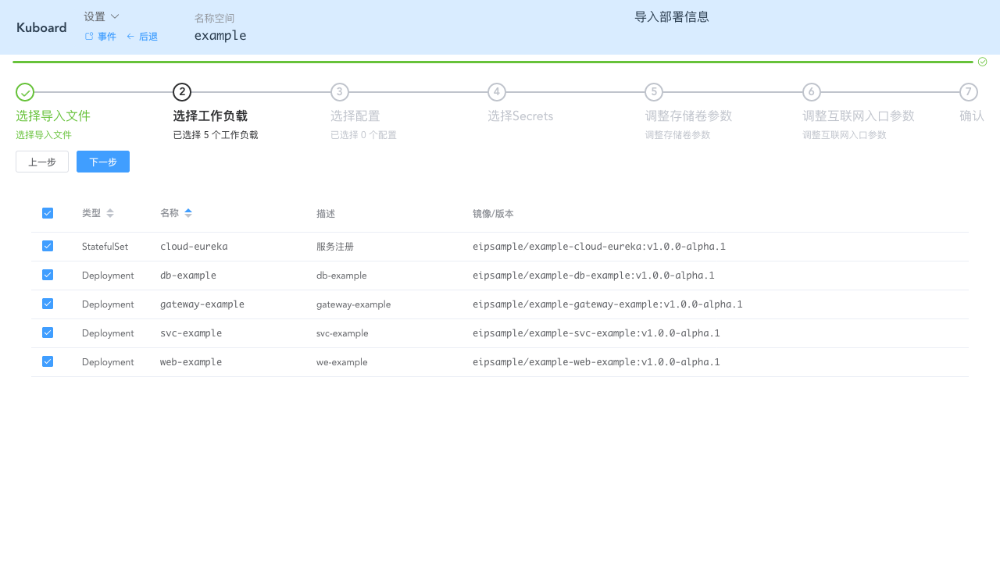

* 点击 ***下一步***

  默认选择所有要导入的配置，example中没有使用到配置信息

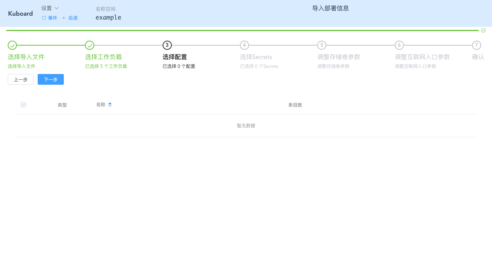

* 点击 ***下一步***

  默认选择所有 Secrets

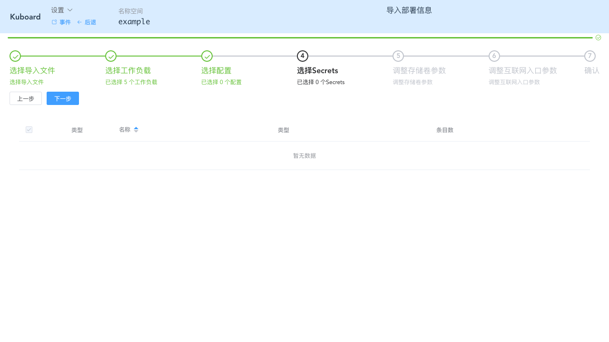

* 点击 ***下一步***

  填写表单：

| 字段名称           | 填写内容           | 说明                                                         |
| ------------------ | ------------------ | ------------------------------------------------------------ |
| 数据卷类型         | db-example-storage | NFS：容器组直连NFS<br />存储卷声明：容器组使用存储卷声明     |
| 是否新建存储卷声明 | 创建新存储卷声明   | 使用已有存储卷声明：可以使用事先创建好的存储卷声明<br />创建新存储卷声明：可以创建新存储卷声明 |
| 分配模式           | 动态分配           |                                                              |
| 读写模式           | 可被多节点读写     | 只能被单节点读写、可被多节点只读、可被多节点读写             |
| 总量               | 2Gi                | 2Gi代表 2G空间                                               |


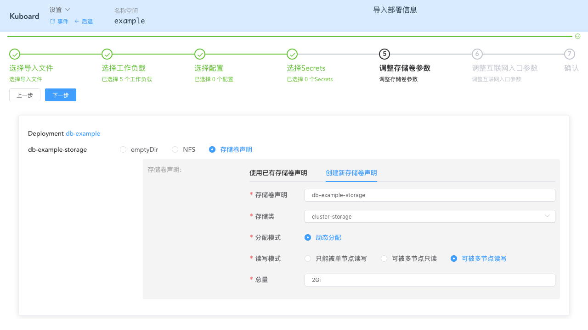

* 点击 ***下一步***

  填写表单：

| 字段名称         | 填写内容                           | 说明                                                         |
| ---------------- | ---------------------------------- | ------------------------------------------------------------ |
| cloud-eureka域名 | cloud-eureka.example.demo.kuboard.cn | 使用您自己的域名，<br />在测试环境建议使用如下域名格式：<br />workloadname.namespace-name.cluster-name.domain.com<br />该域名应该解析到您worker节点的外网地址，或者worker 节点 80/443 端口对应负载均衡服务器的外网地址。 |
| web-example      | web-example.example.demo.eip       |                                                              |

  

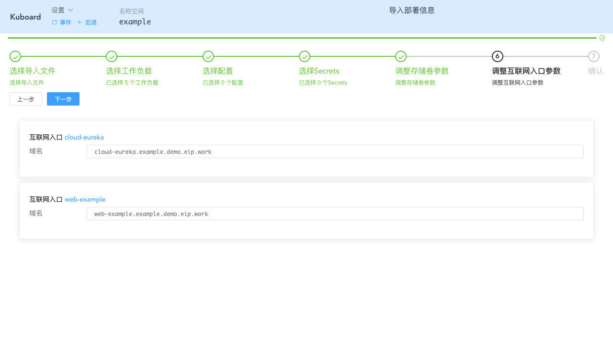

* 点击 ***下一步***

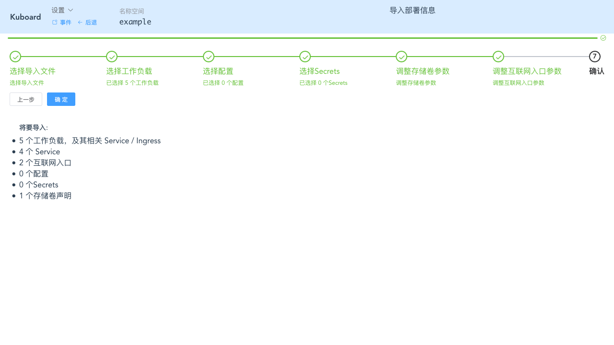


* 点击 ***确定***

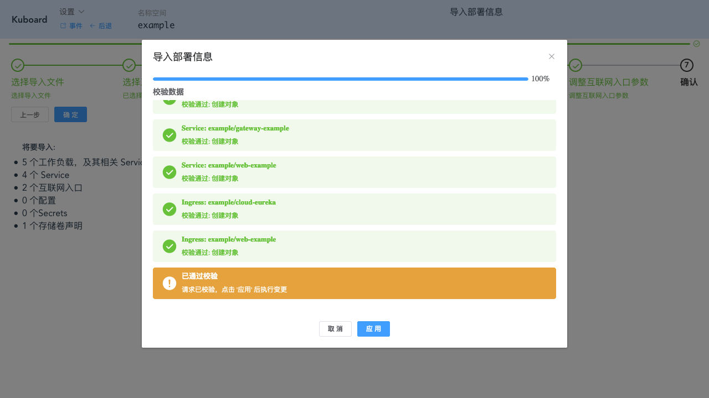

* 点击 ***应用***

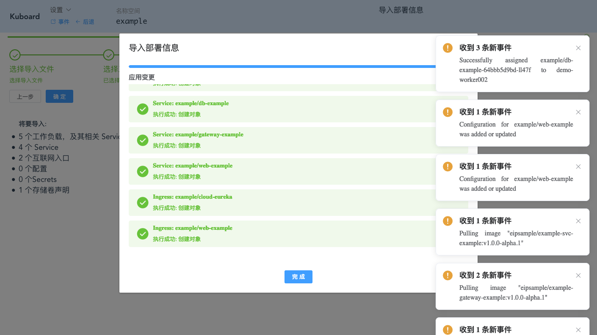

* 点击 ***完成***

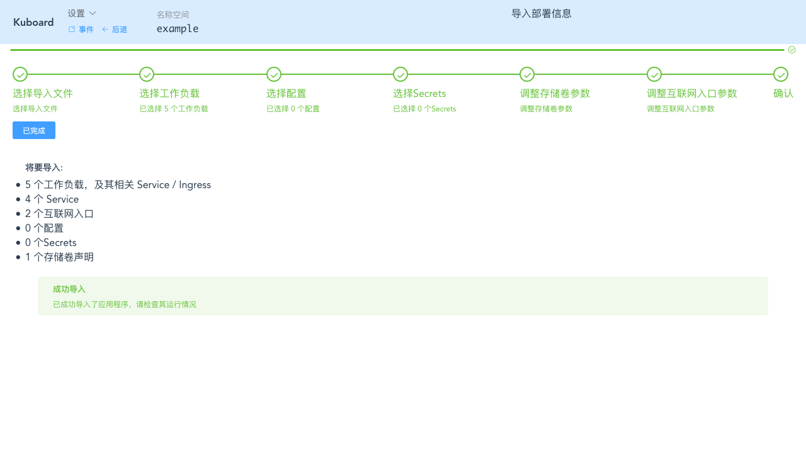

* 点击 ***已完成***

  可再名称空间中查看到刚才导入的 example 的所有工作负载及存储卷声明


## 验证 web-example

* 点击工作负载 ***web-example***

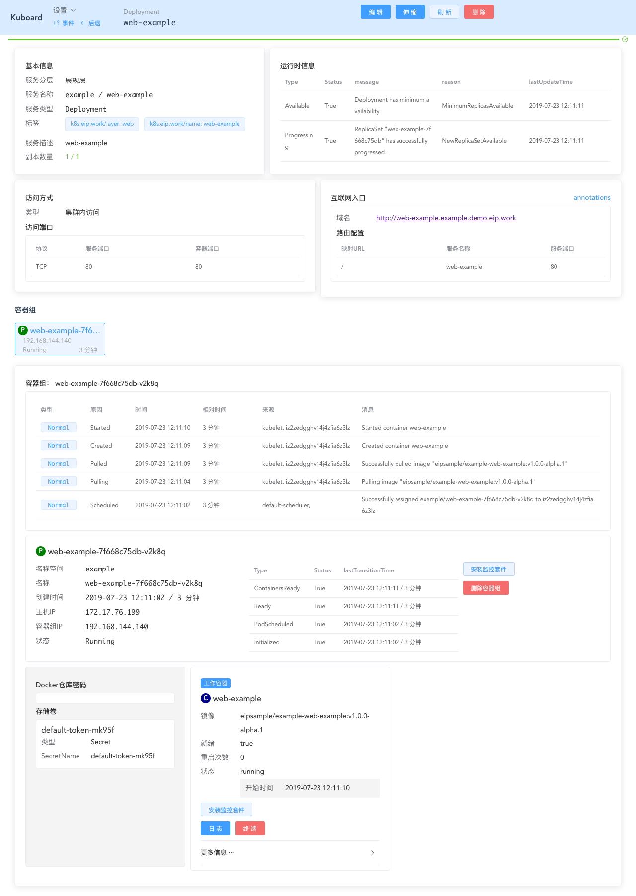

* 点击 互联网入口中的域名 ***http://web-example.example.demo.kuboard.cn***

  **Example 部署成功**


> web-example容器的日志中会出现如下异常，错误原因是，example使用了一个监控套件，该监控套件要求将容器注册到monitor-eureka中，当下我们并没有安装该监控套件。此错误并不影响 example 程序的使用。暂时忽略该异常。
>
> ```
> [DiscoveryClient-InstanceInfoReplicator-0] WARN com.netflix.discovery.shared.transport.decorator.RetryableEurekaHttpClient - Request execution failed with message: java.net.UnknownHostException: monitor-eureka
> [DiscoveryClient-InstanceInfoReplicator-0] WARN com.netflix.discovery.DiscoveryClient - DiscoveryClient_WEB-ADMIN/web-example-7f668c75db-j7ncx - registration failed Cannot execute request on any known server
> com.netflix.discovery.shared.transport.TransportException: Cannot execute request on any known server
>         at com.netflix.discovery.shared.transport.decorator.RetryableEurekaHttpClient.execute(RetryableEurekaHttpClient.java:112)
>         at com.netflix.discovery.shared.transport.decorator.EurekaHttpClientDecorator.register(EurekaHttpClientDecorator.java:56)
>         at com.netflix.discovery.shared.transport.decorator.EurekaHttpClientDecorator$1.execute(EurekaHttpClientDecorator.java:59)
>         at com.netflix.discovery.shared.transport.decorator.SessionedEurekaHttpClient.execute(SessionedEurekaHttpClient.java:77)
>         at com.netflix.discovery.shared.transport.decorator.EurekaHttpClientDecorator.register(EurekaHttpClientDecorator.java:56)
>         at com.netflix.discovery.DiscoveryClient.register(DiscoveryClient.java:829)
>         at com.netflix.discovery.InstanceInfoReplicator.run(InstanceInfoReplicator.java:121)
>         at java.util.concurrent.Executors$RunnableAdapter.call(Executors.java:511)
>         at java.util.concurrent.FutureTask.run(FutureTask.java:266)
>         at java.util.concurrent.ScheduledThreadPoolExecutor$ScheduledFutureTask.access$201(ScheduledThreadPoolExecutor.java:180)
>         at java.util.concurrent.ScheduledThreadPoolExecutor$ScheduledFutureTask.run(ScheduledThreadPoolExecutor.java:293)
>         at java.util.concurrent.ThreadPoolExecutor.runWorker(ThreadPoolExecutor.java:1149)
>         at java.util.concurrent.ThreadPoolExecutor$Worker.run(ThreadPoolExecutor.java:624)
>         at java.lang.Thread.run(Thread.java:748)
> ```
>
> 
