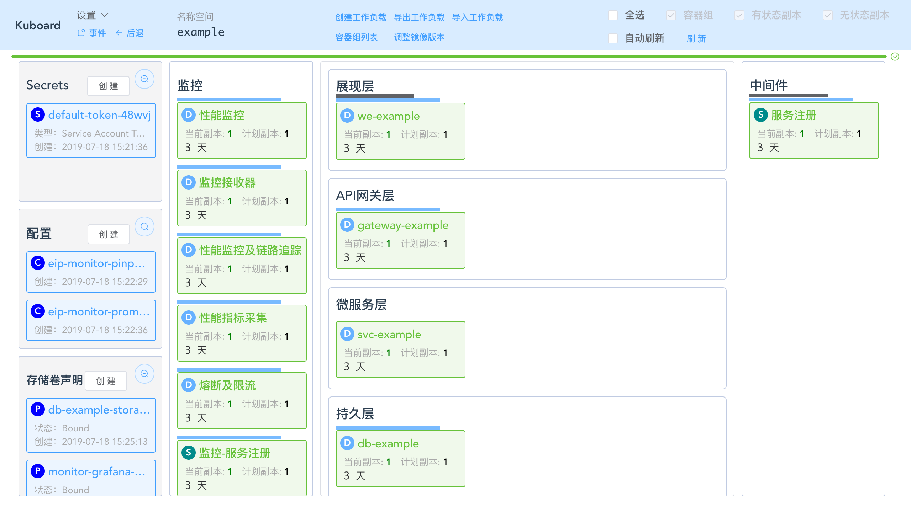
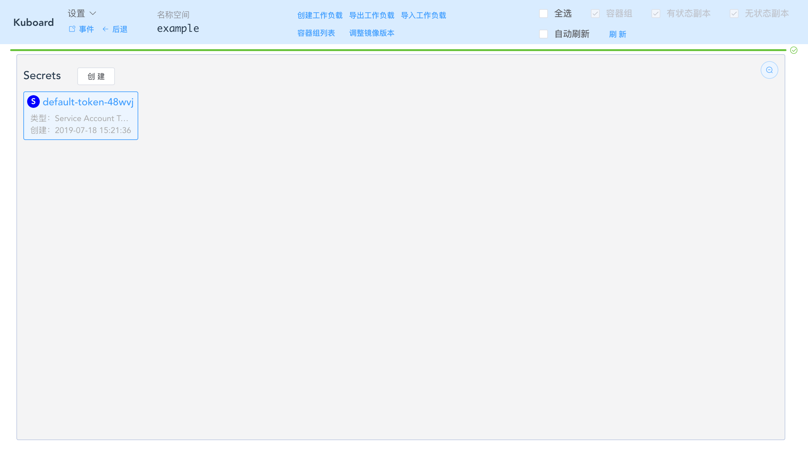
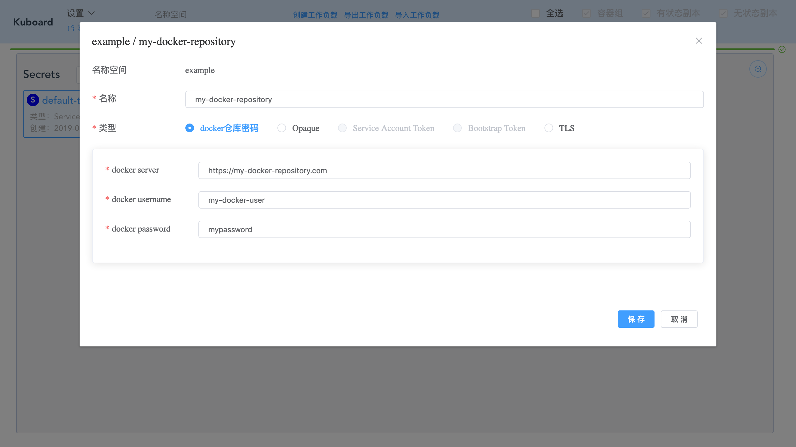
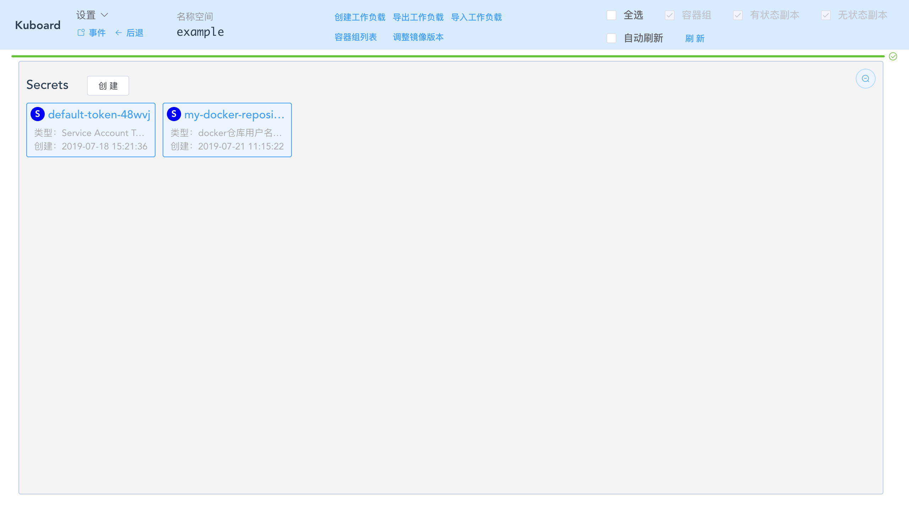
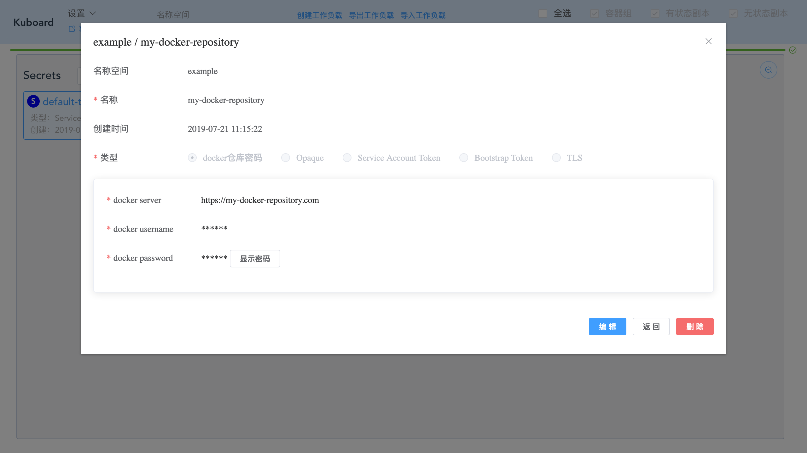

# Secrets

# 查看 Secrets 列表

假设您已进入名称空间界面，如下图所示：

Secrets 列表位于图中左上角，点击 ***放大*** 按钮，可以将列表显示到更大的区域，如下图所示：

> 点击 **Secrets** 可以刷新该列表

# 创建 Secrets

* 点击 ***Secrets / 创建***

  填写表单如下：

| 字段名称        | 填写内容                         | 说明                       |
| --------------- | -------------------------------- | -------------------------- |
| 名称            | my-docker-repository             | Secrets的名称              |
| 类型            | docker仓库密码                   |                            |
| docker server   | https://my-docker-repository.com | 请填写 docker 仓库的全路径 |
| docker username | my-docker-user                   |                            |
| docker password | mypassword                       |                            |

>当前 Kuboard 支持如下类型 Secrets 的创建：
>
>* docker仓库密码
>  * 当您的镜像存储在私有仓库时，您在创建工作负载时可能需要配置 imagePullSecrets 用来访问镜像仓库
>* Opaque
>  * 密码
>* TLS
>  * 当您为 Ingress 启用 HTTPS 时，您需要将域名的的 TLS 证书存入 Secrets

* 点击保存

  Secrets 创建成功，如下图所示：

# 查看/编辑/删除 Secrets

* 点击 my-docker-repository

编辑、删除操作可直接按照提示完成