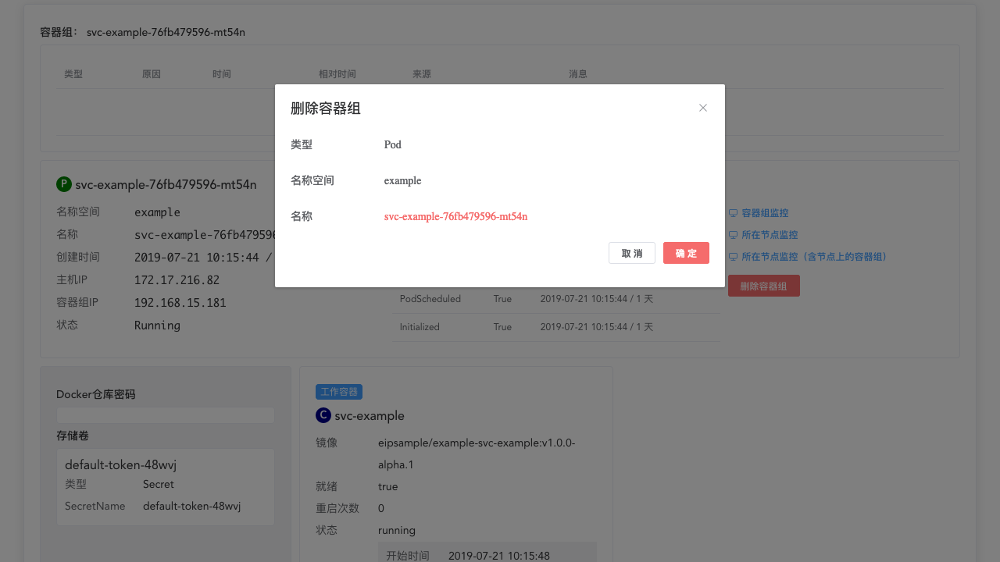
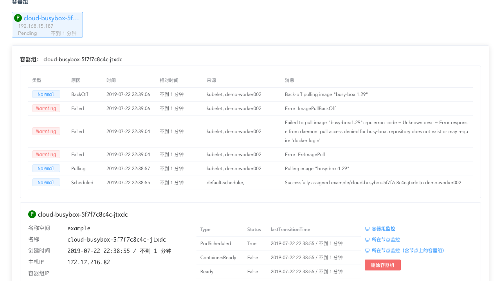
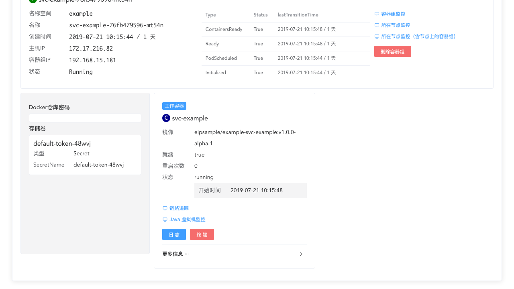
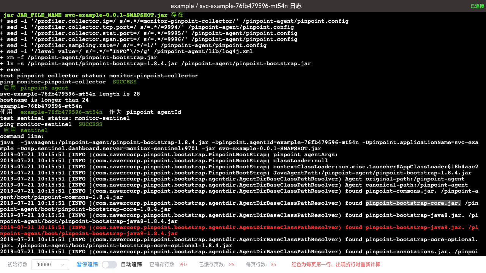

# 工作负载

<AdSenseTitle/>

## 创建/查看/编辑工作负载

请参考 [创建 busybox](/guide/example/busybox.html)

## 伸缩

伸缩操作，通过调整工作负载的 replicas 大小，来控制该工作负载运行容器组的数量。

* 假设您已进入工作负载查看界面，如下图所示：

* 点击 ***伸缩*** 按钮

  填写表单

  副本数： 目标容器组数量

* 点击 ***确定*** 按钮

  等待，知道伸缩操作执行完毕。

## 删除容器组

* 点击 ***删除容器组*** 按钮

  可删除该容器组。

  * 容器组被删除之后，Kubernetes Workload Controller 将要重新创建一个容器组，用于替代被删除的容器组；被删除容器组原有的状态将丢失，新容器组重新从 镜像中加载启动；

  * Kuboard 的工作负载编辑器，默认将容器组的 imagePullPolicy 设置为 Alwarys，因此，每次在容器组启动的时候，Kubenetes 都会尝试从镜像仓库中抓取最新镜像；

## 诊断问题

在诊断工作负载的问题时，Kuboard主要提供三种手段：

### 事件： Kubernetes 部署相关问题

如下图所示，图中提示

> 错误内容：Error: ErrImagePull 该容器组抓取镜像失败
>
> 失败原因：pull access denied for busy-box, repository does not exist or may require 'docker login'

对于这样的错误，需要技术人员检查：

* 容器所在节点与镜像仓库之间的网络连通性
* 容器镜像拼写是否正确
* 如果为私有仓库，是否在工作负载编辑器中正确配置了 docker 仓库用户名密码

!> Kuboard 监听了 Kubernetes 集群的事件变化，您无需刷新页面，即可在工作负载编辑器的容器组界面区域看到该容器相关的最新事件。

通过 Kubernetes 事件所指示出来的问题，通常是集群本身配置的问题，或者是创建工作负载时的参数填写问题，解决这样的问题需要的是 Kubernetes 集群相关的知识和背景，**通常运维人员可以独立解决此类问题**。

### 日志： 容器运行时产生的错误

如下图所示，假设您已进入工作负载查看界面：

* 点击其中的 ***日志*** 按钮

可查看该容器的运行时日志，如下图所示：

**容器运行时问题定位及解决**

日志所指示出来的错误，可能有两类原因：

* 将其容器部署到 Kubernetes 时，参数配置填写错误
* 容器内应用程序自身的 BUG

无论是上述何种原因，运维人员如果请开发人员介入，一起排查这里问题，效果会好很多。

### 终端： 通过交互式命令，在容器内诊断问题

* 点击 ***终端*** 按钮

  可进入该容器的交互式命令界面

**适用场景**

在交互式终端里，**运维人员**可以：

* 通过 ping / curl 等命令，测试网络连通性，测试 Kubernetes 的服务 DNS 解析是否正确
* 通过 export 命令检查该容器的环境变量的设置是否正确

**开发人员** 可以：

* 通过 ls / cat / vi 等命令，查看该容器是否包含了最新的代码变更
* 通过 vi 等命令，临时对容器中的配置文件进行修改，并在验证这种修改有效之后，才将其正式更新到代码库
