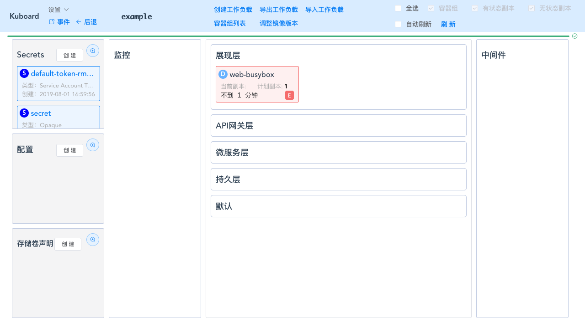

# 错误提示

Kuboard中经常会出现如下情况，某一个工作负载（Deployment/StatefulSet/DaemonSet等）显示为红色，且有一个闪烁的红色 `E` 图标。

此为 Kuboard 中设计的一个错误提示方式，其具体实现方式是：
* 遍历当前的所有事件，对于每一个事件：
  * 如果事件类型为 Normal，则跳过
  * 如果事件类型为 Warining，则对比该事件源对象（产生该事件的Kubernetes 对象）的名字（假设为 event_source_name）与当前工作负载（假设为work_load_name）的名字：
    * 如果 event_source_name.indexOf(work_load_name) === 0，则该工作负载显示错误提示
    * 如果 event_source_name.indexOf(work_load_name) !== 0，则跳过

使用此方式，我们可以快速查看到名称空间中存在问题的工作负载，并迅速对其进行诊断。

但是这种告警方式并不是完美的，具体来说，会发生如下情况：

## 实际正常，但提示错误

实际上，您的工作负载（Deployment、StatefulSet、DaemonSet等）已经正常工作，但是仍然提示有错误信息。此种情况通常发生在类似如下的场景中：

### 场景一：

* 创建Deployment，但未创建所需要的PVC
  * 此时该Deployment的Pod不能调度，并伴随着 PVC 未绑定的错误事件
* 创建PVC，Pod成功调度，Deployment正常工作
  * 此时，虽然Pod已经正常，但是该Pod原来的错误事件仍然存在，因此Kuboard仍然会显示此错误提示

### 场景二：

* 创建Deployment，但该Deployment依赖的数据库未启动
  * 此时该Deployment的Pod将Crash
* 启动数据库
* 删除Deployment原有的Pod
  * 此时Deployment创建新Pod以维持所需要的副本数
  * 新的Pod正常工作
  * 此时，虽然与错误事件关联的Pod已经删除，但是该Pod产生的错误事件仍然存在，且与Deployment的名称匹配，因此，Kuboard仍将显示错误标志

### 修正办法

* 在名称空间左上角点击 **事件** 按钮，将进入事件列表查看界面
* 将已经失效的错误事件删除
  > 点击事件的图标，可删除事件

## 界面卡顿

当名称空间中工作负载的数量，以及集群中错误事件的数量特别多时，在进入名称空间界面时可能出现卡顿，但是只要成功进入，一切工作都是正常的。

卡顿的原因是，Kuboard在循环遍历事件与工作负载的匹配情况，通常只有在在工作负载数量和事件数量都特别多时，才会出现卡顿，在 1.0.4 版本中优化之后，速度已经得到了非常可观的提升。

如果您仍然碰到了卡顿的现象，可以尝试：
* 删除事件
  
  执行命令 `kubectl delete events --all-namespaces`。由于 Kubernetes 的控制器模式，Kubernetes会不断尝试失败的操作，因此，删除事件通常是安全的，过一阵子，原有的错误事件又会重复出现

* 向Kuboard反馈此问题

  本文页尾有Kuboard支持社群的入群方式，直接联系群主即可
