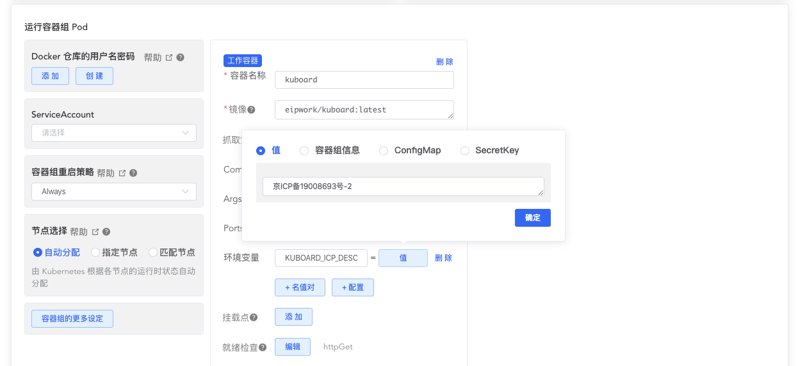
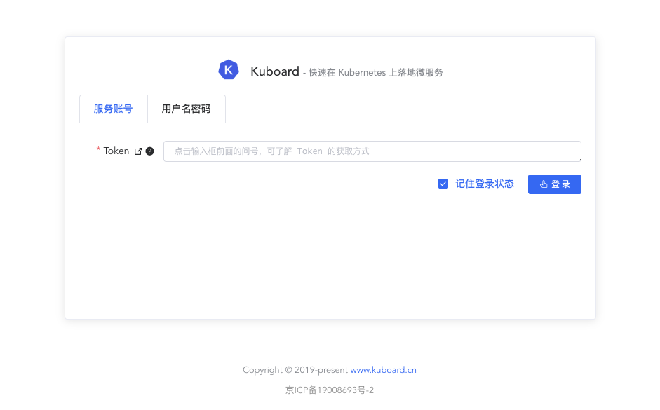

# 安装Kubernetes Dashboard

<AdSenseTitle/>

## 环境变量

安装 Kuboard 后，有如下几个环境变量值得您关注：

| 环境变量名                | 描述                                    | 默认值        |
| ------------------------- | --------------------------------------- | ------------- |
| KUBERNETES_CLUSTER_DOMAIN | Kubernetes Cluster Name                 | cluster.local |
| KUBOARD_ICP_DESCRIPTION   | 您的 ICP 备案号                         | 空            |
| KUBOARD_SAFE_MODE         | 是否禁用监控套件的转发                  | 空            |
| OIDC_ISSUER               | OpenID Connect 对应的 Identity Provider | 空            |

## 修改Kuboard环境变量

* 打开 Kuboard 界面，并导航到 Kuboard 工作负载编辑页：

  kube-system 名称空间 --> Kuboard 工作负载 --> 编辑

* 也可以按如下方式直接进入 Kuboard 工作负载编辑页：

  打开链接 `http://节点IP:32567/namespace/kube-system/workload/edit/Deployment/kuboard`


在 Kuboard 工作负载编辑页，为 `kuboard` 容器添加、修改环境变量，如下图，正在修改 `KUBOARD_ICP_DESCRIPTION` 的取值



## KUBERNETES_CLUSTER_DOMAIN

如果您通过 kubeadm 安装 Kubernetes 集群，执行命令
``` sh
kubeadm config view
```

可以查看到输出结果中的 `networking.dnsDomain` 字段，该字段通常取值为 `cluster.local`，如下所示：
``` yaml {19}
apiServer:
  extraArgs:
    authorization-mode: Node,RBAC
  timeoutForControlPlane: 4m0s
apiVersion: kubeadm.k8s.io/v1beta2
certificatesDir: /etc/kubernetes/pki
clusterName: kubernetes
controlPlaneEndpoint: apiserver.demo:6443
controllerManager: {}
dns:
  type: CoreDNS
etcd:
  local:
    dataDir: /var/lib/etcd
imageRepository: gcr.azk8s.cn/google-containers
kind: ClusterConfiguration
kubernetesVersion: v1.16.4
networking:
  dnsDomain: cluster.local
  serviceSubnet: 10.96.0.0/12
scheduler: {}
```

少数情况下，您安装集群时可能修改了这个字段的取值，此时，请确保您为 Kuboard 设置了 `KUBERNETES_CLUSTER_DOMAIN` 这个环境变量，并将其取值设置与 `networking.dnsDomain` 的取值相同。否则 Kuboard 的一部分功能将无法正常工作。

## KUBOARD_ICP_DESCRIPTION

自 Kuboard v1.0.6.3 开始，用户可以修改 Kuboard 登录页面页尾的 ICP 备案编号及URL。

为 Kuboard 增加环境变量 `KUBOARD_ICP_DESCRIPTION`  取值为您的 ICP 备案号，例如 `京ICP备19008693号-2`，应用生效后，进入 Kuboard 登录界面，将在页尾显示您的 ICP 备案编号，如下图所示：



::: tip 安全提示

Kuboard 用于管理的 Kubernetes 集群上部署的各类资源，如果您想通过公有网络访问 Kuboard，请做好安全防护：

* 建议您限制可以访问 Kuboard 的 IP 地址白名单；
* 不要泄露 ServiceAccount 的 Token，如需要修改 ServiceAccount 的 Token，请参考 [为名称空间创建管理员用户](/learning/k8s-advanced/sec/kuboard.html) 中，关于在 ServiceAccount 界面上删除 Secret 的部分；
* 请为 Kuboard 配置 https 证书，配置方式有：
  * 在 `http://节点IP:32567/namespace/kube-system/workload/edit/Deployment/kuboard` 界面上互联网入口（Ingress）这一部分开启 https 即可配置；
  * 如果您在 Kuboard 前面另外配置了反向代理，请在您自己的反向代理中配置 https 证书；
* 请设置 [KUBOARD_SAFE_MODE](#KUBOARD_SAFE_MODE)

:::


## KUBOARD_SAFE_MODE

在 Kuboard 早期版本中，为了尝试监控套件的功能，在 Kuboard 所使用的 nginx 中设置了比较宽泛的动态转发，具体配置如下所示：

``` nginx.conf
location ^~ /eip-monitor/ {
    location ~ "^/eip-monitor/namespace/(.*)/service/(.*)/port/(.*)/(.*)" {
        resolver 127.0.0.1 valid=5s;
        proxy_pass http://$2.$1.svc.KUBERNETES_CLUSTER_DOMAIN:$3/$4$is_args$args;
        gzip on;
    }
}

location ^~ /addons/ {
    location ~ "^/addons/namespace/(.*)/service/(.*)/port/(.*)/(.*)" {
        resolver 127.0.0.1 valid=5s;
        proxy_pass http://$2.$1.svc.KUBERNETES_CLUSTER_DOMAIN:$3/$4$is_args$args;
        gzip on;
    }
}
```

得益于这样的 nginx 转发规则，kuboard 可以在监控套件的功能中非常简便地跳转到 Kubernetes 上部署的任意 Service。但是，如果将 Kuboard 直接部署到公网，这种操作也使得 Kuboard 留下了一个安全隐患。

通过将环境变量 `KUBOARD_SAFE_MODE` 的值设置为 `KUBOARD_SAFE_MODE_ENABLED`，可以禁用这个转发规则，以获得更好地安全性。

> * 当前，如果您想使用 Kuboard 的 [全局监控套件](/guide/addon/)，请不要设置 `KUBOARD_SAFE_MODE`，请通过其他方式确保安全性，例如，限制只能在内网访问 Kuboard；
> * 在 2020年3月份即将发布 Kuboard v1.0.7 的版本中，将引入 Kuboard Proxy 的功能，该功能可以在兼容 Kuboard 套件的情况下，提升安全性，禁止未经授权的访问；届时，将不再需要设置 `KUBOARD_SAFE_MODE`。

## OIDC_ISSUER

`OIDC_ISSUER` 这个环境变量与 Kubernetes Authentication 相关，建议您不要手工设置此环境变量，如果您想通过 OpenID Connect 的方式登录 Kuboard / Kubectl 请参考 [Kubernetes Authentication 安装向导](/learning/k8s-advanced/sec/authenticate/install.html)，在该向导的引导下，您将能够顺利配置 Kuboard 与 GitHub / GitLab 等的单点登录。
> 设置 `OIDC_ISSUER` 是该向导自动完成的一个步骤。
