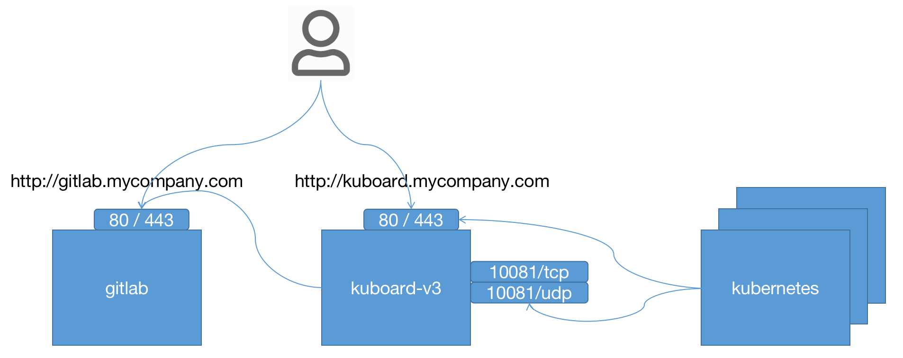
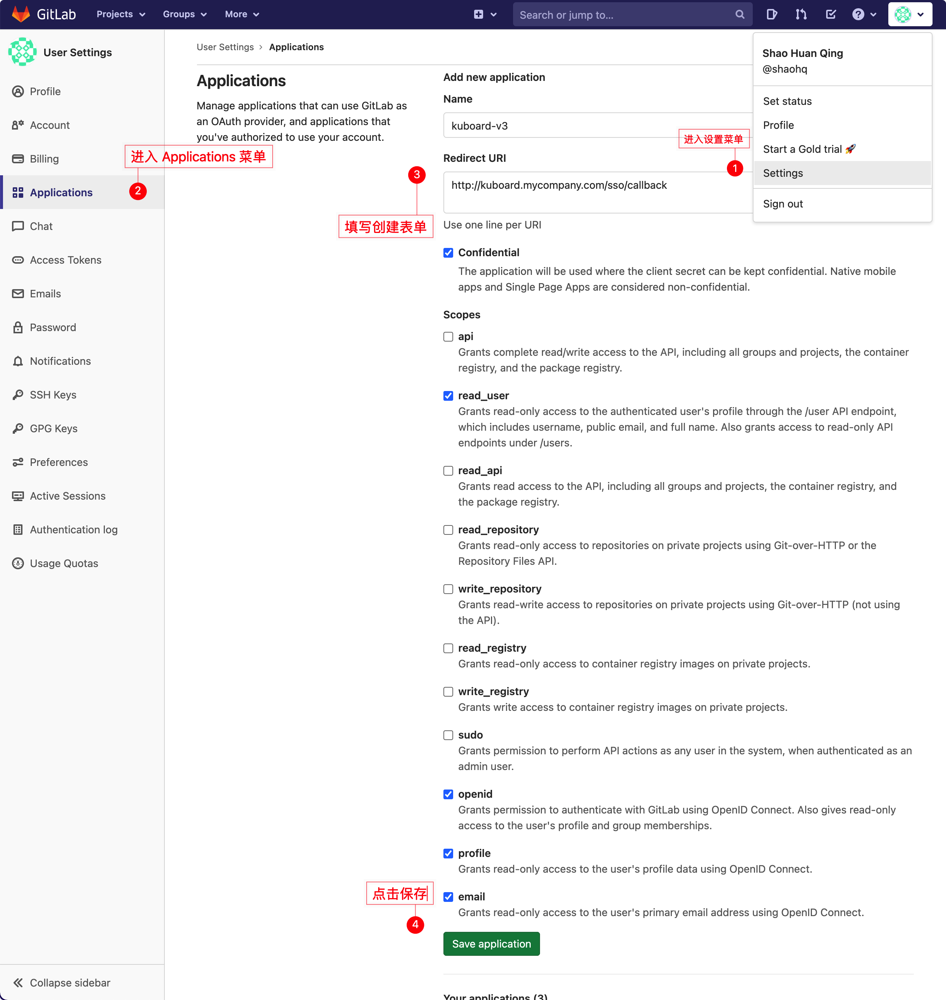
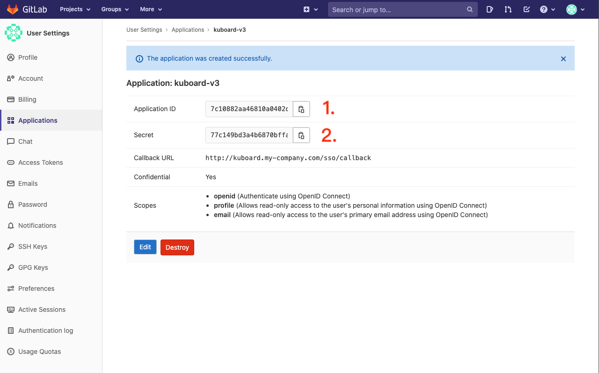
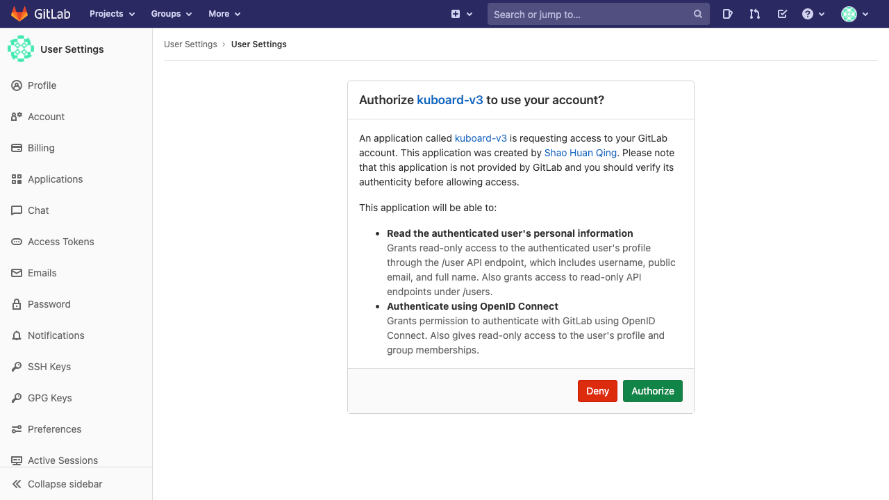
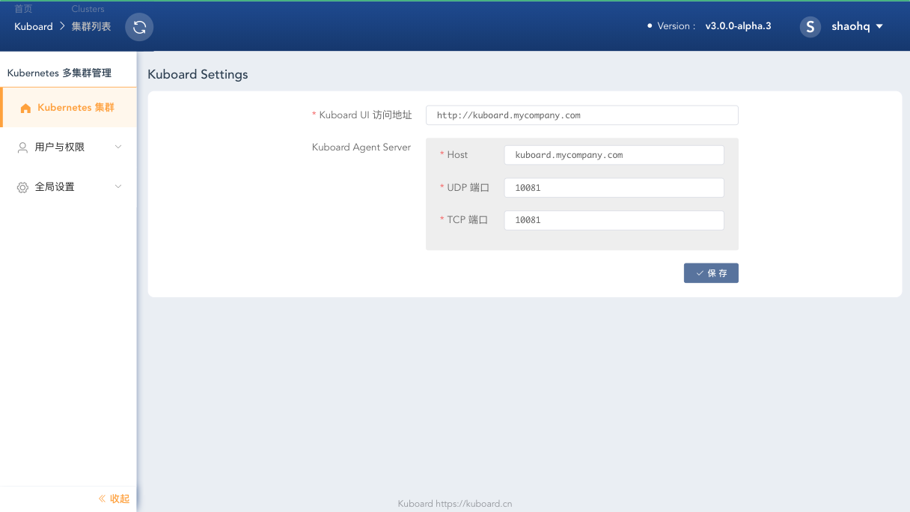
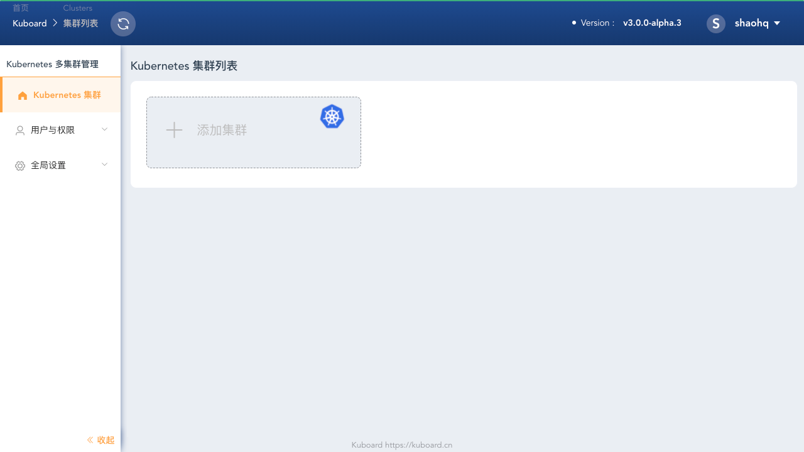

# 安装 Kuboard v3 - gitlab

<AdSenseTitle/>

Kuboard 支持多种认证方式：

* 内建用户库
* GitLab Community Edition / GitLab Enterprise Edition / gitlab.com
* GitHub Enterprise / github.com
* LDAP

本文描述了如何配置 Kuboard v3 使其与 gitlab.com / gitlab ee / gitlab ce 实现单点登录。

## 前提条件

* 用于安装 Kuboard v3.0 的机器已经安装了 docker，并且版本不低于 docker 19.03
* 您已经有自己的 Kubernetes 集群，并且版本不低于 Kubernetes v1.13
* 您已经安装好了 gitlab-ce 或者 gitlab-ee，又或者您打算直接使用 gitlab.com 中的账号

## 部署计划

在正式安装 kuboard v3 之前，需做好一个简单的部署计划的设计，在本例中，各组件之间的连接方式，如下图所示：

* 用户通过 http://gitlab.mycompany.com 访问 gitlab；

* 用户通过 http://kuboard.mycompany.com 访问 Kuboard v3；

* Kuboard 通过 http://gitlab.mycompany.com 访问 GitLab API；

* 安装在 Kubernetes 中的 Kuboard Agent 通过 `kuboard.mycompany.com` 访问 Kuboard 的 Web 服务端口 80 / 443 和 Kuboard Agent Server 端口 10081。




本例子中，假设：

* 您已经准备好了一个 Linux 服务器用于安装 Kuboard-V3
* 您的 gitlab 已经完成安装且版本不低于 11，并且可以从用户的浏览器以及用于安装 Kuboard-V3 的服务器访问到（使用 URL http://gitlab.mycompany.com）
  * 本例子支持 gitlab-ce / gitlab-ee，也支持 gitlab.com


## 准备 GitLab

在 gitlab.com （或者 gitlab ee / gitlab ce）创建 Application，如下图所示：

表单填写说明：

| 字段名称     | 字段取值                                   | 字段说明                                                     |
| ------------ | ------------------------------------------ | ------------------------------------------------------------ |
| Name         | kuboad-v3                                  | 应用程序在 GitLab 中的标识，例如，此处填写了 kuboard-v3      |
| Redirect URI | http://kuboard.my-company.com/sso/callback | 登录成功后的回调 URL，必须填写绝对路径，且必须指定到 kuboard 的 `/sso/callback` 路径 |
| Scopes       | read_user / openid / profile / email       | 应用程序可以访问的 GitLab 接口范围，对于 Kuboard 而言，必须勾选如下几个选项： read_user / openid / profile / email |




完成创建后，您将获得 `Application ID` 以及 `Secret` 两个字段的值，如下图所示：



## 启动 Kuboard

使用如下命令启动 Kuboard v3：
``` sh
sudo docker run -d \
  --restart=unless-stopped \
  --name=kuboard \
  -p 80:80/tcp \
  -p 10081:10081/udp \
  -p 10081:10081/tcp \
  -v /root/kuboard-data:/data \
  -e KUBOARD_LOGIN_TYPE="gitlab" \
  -e KUBOARD_ENDPOINT="http://kuboard.mycompany.com" \
  -e KUBOARD_ROOT_USER="shaohq" \
  -e GITLAB_BASE_URL="http://gitlab.mycompany.com" \
  -e GITLAB_APPLICATION_ID="7c10882aa46810a0402d17c66103894ac5e43d6130b81c17f7f2d8ae182040b5" \
  -e GITLAB_CLIENT_SECRET="77c149bd3a4b6870bffa1a1afaf37cba28a1817f4cf518699065f5a8fe958889" \
  eipwork/kuboard:v3-alpha
```

::: tip 参数说明
* 建议将此命令保存为一个 shell 脚本，例如 `start-kuboard.sh`，后续升级 Kuboard 或恢复 Kuboard 时，需要通过此命令了解到最初安装 Kuboard 时所使用的参数；
* 第 4 行，Kuboard v3.0 需要暴露 `80` 端口，如安装指令的第三行所示，默认映射到了宿主机的 `80` 端口，您可以根据自己的情况选择宿主机的其他端口；
* 第 5、6 行，Kuboard v3.0 需要暴露 `10081` 端口 TCP / UDP，默认映射到了宿主机的 `10081` 端口，您可以根据自己的情况选择宿主机的其他端口；
* 第 7 行，Kuboard v3.0 的持久化数据存储在 `/data` 目录，默认映射到了宿主机的 `/root/kuboard-data` 路径，请根据您自己的情况进行调整；
* 第 8 行，将 Kuboard v3.0 与 GitLab 进行单点登录集成时，必须指定环境变量 `KUBOARD_LOGIN_TYPE` 为 `gitlab` （适用于 gitlab.com / gitlab-ee / gitlab-ce）；
* 第 9 行，必须指定 `KUBOARD_ENDPOINT` 环境变量为访问 Kuboard 界面的 URL；（如 [部署计划](#部署计划) 中所描述，本例子中，使用 `http://kuboard.mycompany.com` 作为通过执行此命令启动的 Kuboard 的访问 URL）；此参数不能以 `/` 结尾；
* 第 10 行，必须指定 `KUBOARD_ROOT_USER`，使用该 GitLab 用户登录到 Kuboard 以后，该用户具备 Kuboard 的所有权限；
* 第 11 行，指定 `GIBLAB_BASE_URL`，（如 [部署计划](#部署计划) 中所描述，本例子中，使用 `http://gitlab.mycompany.com` 作为通过作为 GitLab 的访问 URL，并假设 GitLab 已经事先准备就绪，如果不指定，该参数默认值为 `https://gitlab.com`）；此参数不能以 `/` 结尾；
* 第 12 行，必须指定 `GITLAB_APPLICATION_ID`，该参数来自于 [准备 GitLab](#准备-gitlab) 步骤中创建的 GitLab  Application 的 `Application ID` 字段
* 第 13 行，必须指定 `GITLAB_CLIENT_SECRET`，该参数来自于 [准备 GitLab](#准备-gitlab) 步骤中创建的 GitLab  Application 的 `Secret` 字段
:::

## 访问 Kuboard 界面

* 在浏览器中输入 `http://kuboard.mycompany.com`，您将被重定向到 GitLab 登录界面；
* 在 GitLab 登录界面使用 docker run 命令中 `KUBOARD_ROOT_USER` 参数指定的用户完成登录后，GitLab 将提示您是否授权访问 Kuboard，如下图所示：

  

* 点击上图中的 ***Authorize*** 按钮后，您将成功登录 Kuboard 界面，第一次登录时，界面显示如下所示：

  根据 [部署计划](#部署计划) 的设想，如下表单的填写内容为：

  | 参数名称                                             | 参数值                                                       | 参数说明                                                     |
  | ---------------------------------------------------- | ------------------------------------------------------------ | ------------------------------------------------------------ |
  | <div style="width: 170px;">Kuboard UI 访问地址</div> | <div style="width: 130px;">http://kuboard.mycompany.com</div> | 根据 [部署计划](#部署计划) ，安装在 Kubernetes 中的 Kuboard Agent 通过 http://kuboard.mycompany.com 这个 URL 访问 Kuboard Web 界面，此处为 Kubernetes 集群和 Kuboard 浏览器端用户设定了不同的访问域名（在 docker run 命令的 `KUBOARD_ENDPOINT` 参数指定）。 |
  | Agent Server Host                                    | kuboard.mycompany.com                                        | 根据 [部署计划](#部署计划) ，安装在 Kubernetes 中的 Kuboard Agent 通过 kuboard.mycompany.com 解析到 Kuboard 所在宿主机的 IP 地址 |
  | Agent Server UDP 端口                                | 10081                                                        | 此端口必须与 docker run 命令中映射的 10081/udp 端口一致      |
  | Agent Server TCP 端口                                | 10081                                                        | 此端口必须与 docker run 命令中映射的 10081/tcp 端口一致      |
  
  
  
  
* 点击上图中的 ***保存*** 按钮，您将进入 Kuboard 集群列表页，此时，您可以向 Kuboard 添加 Kubernetes 集群，如下图所示：

  

## 授权用户访问 Kuboard

默认情况下，只有 `KUBOARD_ROOT_USER` 参数指定的用户可以执行 Kuboard 中的所有操作，其他用户通过单点登录进入 Kuboard 系统后，除了退出系统，几乎什么事情也做不了。为了让单点登录的用户获得合适的权限，您需要在 Kuboard 中为对应的用户/用户组授权。请参考 [为单点登录的用户/用户组授权](./auth-user-sso.html)
