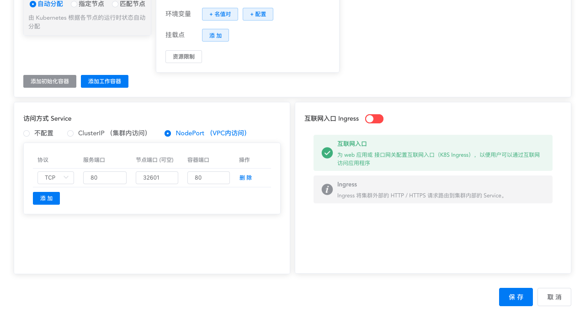

# 3.公布应用程序

本文翻译自 Kubernetes 官网 [Using a Service to Expose Your App](https://kubernetes.io/docs/tutorials/kubernetes-basics/expose/expose-intro/) ，并有所改写

## 目标

- 了解 Kubernetes 的 Service（服务）
- 了解 Labels（标签）和 LabelSelector（标签选择器）与 Service（服务）的关系
- 在 kubernetes 集群中，通过 Service（服务）向外公布应用程序

## Kubernetes Service（服务）概述

事实上，Pod（容器组）有自己的 [生命周期](https://kubernetes.io/docs/concepts/workloads/pods/pod-lifecycle/)。当 worker node（节点）故障时，节点上运行的 Pod（容器组）也会消失。然后，[Deployment](https://kubernetes.io/docs/concepts/workloads/controllers/deployment/) 可以通过创建新的 Pod（容器组）来动态地将群集调整回原来的状态，以使应用程序保持运行。

举个例子，假设有一个图像处理后端程序，具有 3 个运行时副本。这 3 个副本是可以替换的（无状态应用），即使 Pod（容器组）消失并被重新创建，或者副本数由 3 增加到 5，前端系统也无需关注后端副本的变化。由于 Kubernetes 集群中每个 Pod（容器组）都有一个唯一的 IP 地址（即使是同一个 Node 上的不同 Pod），我们需要一种机制，为前端系统屏蔽后端系统的 Pod（容器组）在销毁、创建过程中所带来的 IP 地址的变化。

Kubernetes 中的 **Service（服务）** 提供了这样的一个抽象层，它选择具备某些特征的 Pod（容器组）并为它们定义一个访问方式。Service（服务）使 Pod（容器组）之间的相互依赖解耦<font color="#999999">（原本从一个 Pod 中访问另外一个 Pod，需要知道对方的 IP 地址）</font>。一个 Service（服务）选定哪些 **Pod（容器组）** 通常由 **LabelSelector(标签选择器)** 来决定。

在创建Service的时候，通过设置配置文件中的 spec.type 字段的值，可以以不同方式向外部暴露应用程序：

- **ClusterIP**（默认）
  
  在群集中的内部IP上公布服务，这种方式的 Service（服务）只在集群内部可以访问到

- **NodePort**
  
  使用 NAT 在集群中每个的同一端口上公布服务。这种方式下，可以通过访问集群中任意节点+端口号的方式访问服务 `<NodeIP>:<NodePort>`。此时 ClusterIP 的访问方式仍然可用。

- **LoadBalancer**
  
  在云环境中（需要云供应商可以支持）创建一个集群外部的负载均衡器，并为使用该负载均衡器的 IP 地址作为服务的访问地址。此时 ClusterIP 和 NodePort 的访问方式仍然可用。

::: tip
Service是一个抽象层，它通过 LabelSelector 选择了一组 Pod（容器组），把这些 Pod 的指定端口公布到到集群外部，并支持负载均衡和服务发现。
* 公布 Pod 的端口以使其可访问
* 在多个 Pod 间实现负载均衡
* 使用 Label 和 LabelSelector
:::

## 服务和标签

下图中有两个服务Service A(蓝色虚线)和Service B(黄色虚线)
Service A 将请求转发到 IP 为 10.10.10.1 的Pod上，
Service B 将请求转发到 IP 为 10.10.10.2、10.10.10.3、10.10.10.4 的Pod上。

</img>


Service 将外部请求路由到一组 Pod 中，它提供了一个抽象层，使得 Kubernetes 可以在不影响服务调用者的情况下，动态调度容器组<font color="#AAAAAA">（在容器组失效后重新创建容器组，增加或者减少同一个 Deployment 对应容器组的数量等）</font>。

Service使用 [Labels、LabelSelector(标签和选择器)](https://kubernetes.io/docs/concepts/overview/working-with-objects/labels) 匹配一组 Pod。Labels（标签）是附加到 Kubernetes 对象的键/值对，其用途有多种：

- 将 Kubernetes 对象（Node、Deployment、Pod、Service等）指派用于开发环境、测试环境或生产环境
- 嵌入版本标签，使用标签区别不同应用软件版本
- 使用标签对 Kubernetes 对象进行分类

下图体现了 Labels（标签）和 LabelSelector（标签选择器）之间的关联关系

* Deployment B 含有 LabelSelector 为 app=B <font color="#AAAAAA">通过此方式声明含有 app=B 标签的 Pod 与之关联</font>
* 通过 Deployment B 创建的 Pod 包含标签为 app=B
* Service B 通过标签选择器 app=B 选择可以路由的 Pod

</img>

Labels（标签）可以在创建 Kubernetes 对象时附加上去，也可以在创建之后再附加上去。任何时候都可以修改一个 Kubernetes 对象的 Labels（标签）

## 实战：为您的 nginx Deployment 创建一个 Service

:::: tabs type:border-card

::: tab 使用kubectl lazy

创建nginx的Deployment中定义了Labels，如下：

``` yaml
metadata:	#译名为元数据，即Deployment的一些基本属性和信息
  name: nginx-deployment	#Deployment的名称
  labels:	#标签，可以灵活定位一个或多个资源，其中key和value均可自定义，可以定义多组
    app: nginx	#为该Deployment设置key为app，value为nginx的标签
```

**创建文件 nginx-service.yaml**

``` sh
vim nginx-service.yaml
```

**文件内容如下：**

<CodeSwitcher :languages="{comment:'有注释',nocomment:'无注释'}" :isolated="true">
<template v-slot:comment>

``` yaml
apiVersion: v1
kind: Service
metadata:
  name: nginx-service	#Service 的名称
  labels:     	#Service 自己的标签
    app: nginx	#为该 Service 设置 key 为 app，value 为 nginx 的标签
spec:	    #这是关于该 Service 的定义，描述了 Service 如何选择 Pod，如何被访问
  selector:	    #标签选择器
    app: nginx	#选择包含标签 app:nginx 的 Pod
  ports:
  - name: nginx-port	#端口的名字
    protocol: TCP	    #协议类型 TCP/UDP
    port: 80	        #集群内的其他容器组可通过 80 端口访问 Service
    nodePort: 32600   #通过任意节点的 32600 端口访问 Service
    targetPort: 80	#将请求转发到匹配 Pod 的 80 端口
  type: NodePort	#Serive的类型，ClusterIP/NodePort/LoaderBalancer
```
</template>
<template v-slot:nocomment>

``` yaml
apiVersion: v1
kind: Service
metadata:
  name: nginx-service
  labels:
    app: nginx
spec:
  selector:
    app: nginx
  ports:
  - name: nginx-port
    protocol: TCP
    port: 80
    nodePort: 32600
    targetPort: 80
  type: NodePort
```

</template>
</CodeSwitcher>

**执行命令**

``` sh
kubectl apply -f nginx-service.yaml
```

**检查执行结果**

``` sh
kubectl get services -o wide
```

可查看到名称为 nginx-service 的服务。

**访问服务**

``` sh
curl <任意节点的 IP>:32600
```
> 如果您的集群在云上，您可能通过云服务商的安全组开放 32600 端口的访问

:::

::: tab 使用Kuboard lazy

* 在 default 名称空间 点击 ***展现层 --> Nginx部署***

* 点击 ***编辑*** 按钮

* 填写表单如下：

​		访问方式 Service 选择 ***NodePort（VPC内访问）***

​		填写一条记录：

  | 协议 | 服务端口 | 节点端口 | 容器端口 |
  | ---- | -------- | -------- | -------- |
  | TCP  | 80       | 32601    | 80       |

如下图所示：



* 点击 **保存**

* **访问服务**

  在浏览器打开 `http://<任意节点的 IP>:32601`

:::

::::


~~到目前为止，我们已经成功部署好项目，并能够对其进行访问，

~~接下来是对于多实例部署和滚动更新的相关介绍与实践

~~let‘s go-> [应用程序的伸缩](./scale.html)
