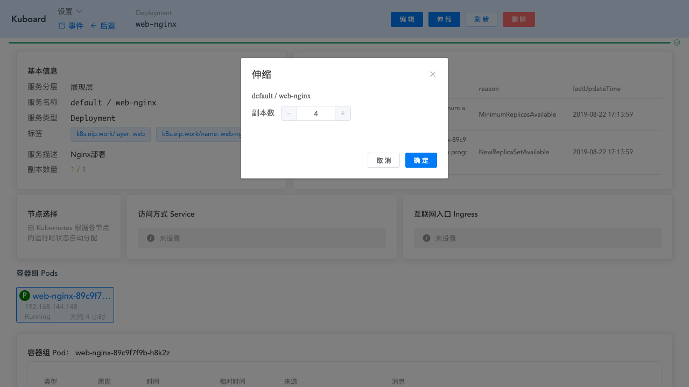
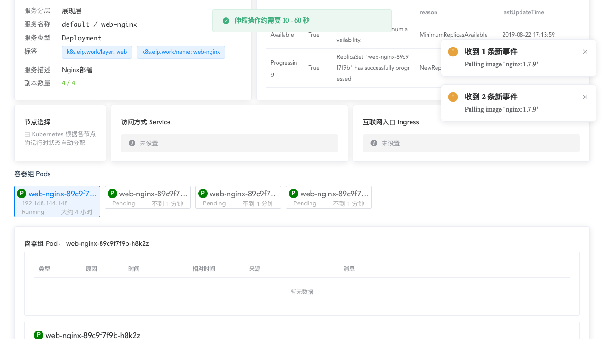

# 4.伸缩应用程序

本文翻译自 Kubernetes 官网 [Running Multiple Instances of Your App](https://kubernetes.io/docs/tutorials/kubernetes-basics/scale/scale-intro/) ，并有所改写

## 目标

- 使用 kubectl 伸缩应用程序。

## Scaling（伸缩）应用程序

在之前的文章中，我们创建了一个 [Deployment](https://kubernetes.io/docs/concepts/workloads/controllers/deployment/)，然后通过 [服务](https://kubernetes.io/docs/concepts/services-networking/service/) 提供访问 Pod 的方式。我们发布的 Deployment 只创建了一个 Pod 来运行我们的应用程序。当流量增加时，我们需要对应用程序进行伸缩操作以满足系统性能需求。

**伸缩** 的实现可以通过更改 nginx-deployment.yaml 文件中部署的 replicas（副本数）来完成

``` yaml
spec:
  replicas: 2    #使用该Deployment创建两个应用程序实例
```

## Scaling（伸缩）概述

下图中，Service A 只将访问流量转发到 IP 为 10.0.0.5 的Pod上

</img>

修改了 Deployment 的 replicas 为 4 后，Kubernetes 又为该 Deployment 创建了 3 新的 Pod，这 4 个 Pod 有相同的标签。因此Service A通过标签选择器与新的 Pod建立了对应关系，将访问流量通过负载均衡在 4 个 Pod 之间进行转发。

</img>

::: tip
通过更改部署中的 replicas（副本数）来完成扩展
:::

## 实战：将 nginx Deployment 扩容到 4 个副本

:::: tabs type:border-card

::: tab 使用kubectl lazy

**修改 nginx-deployment.yaml 文件**

将 replicas 修改为 4

``` yaml {8}
apiVersion: apps/v1
kind: Deployment
metadata:
  name: nginx-deployment
  labels:
    app: nginx
spec:
  replicas: 4
  selector:
    matchLabels:
      app: nginx
  template:
    metadata:
      labels:
        app: nginx
    spec:
      containers:
      - name: nginx
        image: nginx:1.7.9
        ports:
        - containerPort: 80
```

**执行命令**

``` sh
kubectl apply -f nginx-deployment.yaml
```

**查看结果**

``` sh
watch kubectl get pods -o wide
```

:::

::: tab 使用Kuboard

* 在 default 名称空间 点击 ***展现层 --> Nginx部署***

* 点击 ***伸缩*** 按钮

  填写表单

  副本数： 4



* 点击 ***确定*** 按钮

  等待新增的容器组完成初始化，如下图所示：



:::

::::

~~一旦运行了多个应用程序实例，就可以在不停机的情况下执行滚动更新了，

~~let‘s go->  [执行滚动更新](./update.html)
