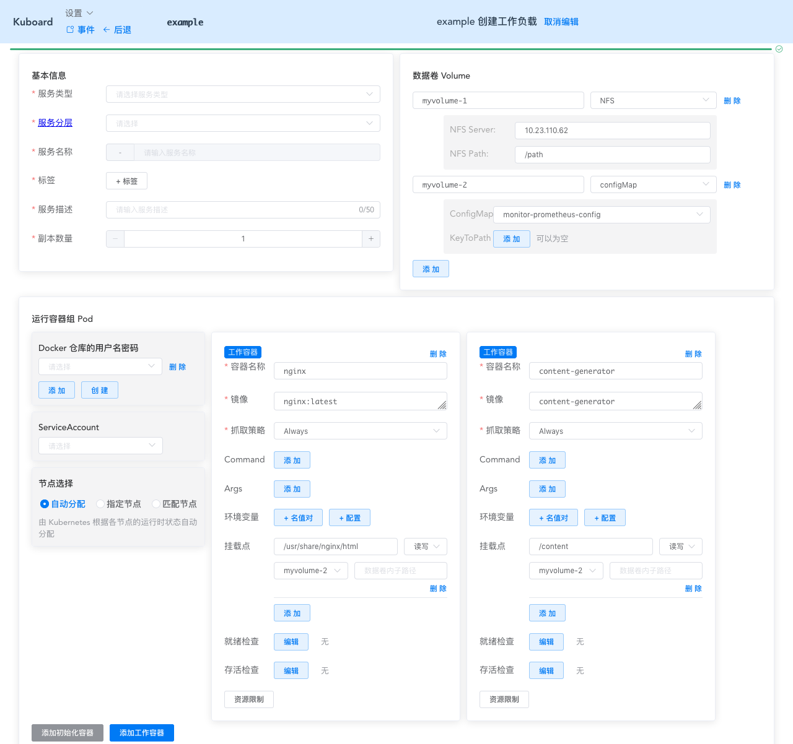

# 数据卷 Volume

参考文档： Kubernetes 官网文档 [Volumes](https://kubernetes.io/docs/concepts/storage/volumes/)

## 数据卷概述

Kubernetes Volume（数据卷）主要解决了如下两方面问题：
* 数据持久性：通常情况下，容器运行起来之后，写入到其文件系统的文件暂时性的。当容器崩溃后，kubelet 将会重启该容器，此时原容器运行后写入的文件将丢失，因为容器将重新从镜像创建。
* 数据共享：同一个 Pod（容器组）中运行的容器之间，经常会存在共享文件/文件夹的需求

Docker 里同样也存在一个 volume（数据卷）的概念，但是 docker 对数据卷的管理相对 kubernetes 而言要更少一些。在 Docker 里，一个 Volume（数据卷）仅仅是宿主机（或另一个容器）文件系统上的一个文件夹。Docker 并不管理 Volume（数据卷）的生命周期。

在 Kubernetes 里，Volume（数据卷）存在明确的生命周期（与包含该数据卷的容器组相同）。因此，Volume（数据卷）的生命周期比同一容器组中任意容器的生命周期要更长，不管容器重启了多少次，数据都能被保留下来。当然，如果容器组退出了，数据卷也就自然退出了。此时，根据容器组所使用的 Volume（数据卷）类型不同，数据可能随数据卷的退出而删除，也可能被真正持久化，并在下次容器组重启时仍然可以使用。

从根本上来说，一个 Volume（数据卷）仅仅是一个可被容器组中的容器访问的文件目录（也许其中包含一些数据文件）。这个目录是怎么来的，取决于该数据卷的类型（不同类型的数据卷使用不同的存储介质）。

使用 Volume（数据卷）时，我们需要先在容器组中定义一个数据卷，并将其挂载到容器的挂载点上。容器中的一个进程所看到（可访问）的文件系统是由容器的 docker 镜像和容器所挂载的数据卷共同组成的。Docker 镜像将被首先加载到该容器的文件系统，任何数据卷都被在此之后挂载到指定的路径上。Volume（数据卷）不能被挂载到其他数据卷上，或者通过引用其他数据卷。同一个容器组中的不同容器各自独立地挂载数据卷，即同一个容器组中的两个容器可以将同一个数据卷挂载到各自不同的路径上。

我们现在通过下图来理解 容器组、容器、挂载点、数据卷、存储介质（nfs、PVC、ConfigMap）等几个概念之间的关系：

* 一个容器组可以包含多个数据卷、多个容器
* 一个容器通过挂载点决定某一个数据卷被挂载到容器中的什么路径
* 不同类型的数据卷对应不同的存储介质（图中列出了 nfs、PVC、ConfigMap 三种存储介质，接下来将介绍更多）

## 在 Kuboard 中使用数据卷

在 Kuboard 工作负载编辑器中，数据卷和容器组的关联如下图所示：

* 数据卷 Volume 区域，定义了两个数据卷：

  * myvolume-1，类型为 nfs
  * myvolume-2，类型为 configMap

* 容器组区域，定义了两个容器：

  * nginx

    将 myvolume-2 数据卷挂载到该容器的 /usr/share/nginx/html 路径

  * content-generator

    将 myvolume-2 数据卷挂载到该容器的 /content 路径

::: tip 数据卷内子路径（subPath）

如图所示，挂载点上还可以定义 ***数据卷内子路径***，***数据卷内子路径*** 用于指定将数据卷所对应目录下的某一个子目录挂载到容器的挂载点，而不是将数据卷对应的目录的根路径挂载到容器的挂载点

:::

## 数据卷的类型

Kubernetes 目前支持多达 28 种数据卷类型（其中大部分特定于具体的云环境如 GCE/AWS/Azure 等），如需查阅所有的数据卷类型，请查阅 Kubernetes 官方文档 [Volumes](https://kubernetes.io/docs/concepts/storage/volumes/)

本文针对自建 Kubernetes 时，经常使用的数据卷的类型描述如下：

### emptyDir <Badge text="Kuboard已支持" type="success"/>

* **描述**

  emptyDir类型的数据卷在容器组被创建时分配给该容器组，并且直到容器组被移除，该数据卷才被释放。该数据卷初始分配时，始终是一个空目录。同一容器组中的不同容器都可以对该目录执行读写操作，并且共享其中的数据，（尽管不同的容器可能将该数据卷挂载到容器中的不同路径）。当容器组被移除时，emptyDir数据卷中的数据将被永久删除

  ::: tip  
  容器崩溃时，kubelet 并不会删除容器组，而仅仅是将容器重启，因此 emptyDir 中的数据在容器崩溃并重启后，仍然是存在的。
  :::

* **适用场景**

  * 空白的初始空间，例如合并/排序算法中，临时将数据存在磁盘上
  * 长时间计算中存储检查点（中间结果），以便容器崩溃时，可以从上一次存储的检查点（中间结果）继续进行，而不是从头开始
  * 作为两个容器的共享存储，使得第一个内容管理的容器可以将生成的页面存入其中，同时由一个 webserver 容器对外提供这些页面
  * 默认情况下，emptyDir 数据卷被存储在 node（节点）的存储介质（机械硬盘、SSD、或者网络存储）上。此外，您可以设置 emptyDir.medium 字段为 "Memory"，此时 Kubernetes 将挂载一个 tmpfs（基于 RAM 的文件系统）。tmpfs 的读写速度非常快，但是与磁盘不一样，tmpfs 在节点重启后将被清空，且您向该 emptyDir 写入文件时，将消耗对应容器的内存限制。<Badge text="Kuboard暂不支持 emptyDir.medium" type="warn"/>

### nfs <Badge text="Kuboard已支持" type="success"/>

* **描述**

  nfs 类型的数据卷可以加载 NFS（Network File System）到您的容器组/容器。容器组被移除时，将仅仅 umount（卸载）NFS 数据卷，NFS 中的数据仍将被保留。

  * 可以在加载 NFS 数据卷前就在其中准备好数据；
  * 可以在不同容器组之间共享数据；
  * 可以被多个容器组加载并同时读写；

* **适用场景**

  * 存储日志文件
  * MySQL的data目录（建议只在测试环境中）
  * 用户上传的临时文件

### cephfs <Badge text="Kuboard正在计划中" type="warn"/>

* **描述**

  cephfs 数据卷使得您可以挂载一个外部 CephFS 卷到您的容器组中。对于 kubernetes 而言，cephfs 与 nfs 的管理方式和行为完全相似，适用场景也相同。不同的仅仅是背后的存储介质。

* **适用场景**

  同 nfs 数据卷

### hostPath <Badge text="Kuboard已支持" type="success"/>

* **描述**

  hostPath 类型的数据卷将 Pod（容器组）所在节点的文件系统上某一个文件或文件夹挂载进容器组（容器）。

  除了为 hostPath 指定 path 字段以外，您还可以为其指定 type 字段，可选的 type 字段描述如下：

  | Type字段取值          | 描述                                                         |
  | --------------------- | ------------------------------------------------------------ |
  |                       | 空字符串（default）用于向后兼容，此时，kubernetes 在挂载 hostPath 数据卷前不会执行任何检查 |
  | **DirectoryOrCreate** | 如果指定的 hostPath 路径不存在，kubernetes 将在节点的该路径上创建一个空文件夹，权限设置为 0755，与 kubelet 进程具备相同的 group 和 ownership |
  | **Directory**         | 指定 hostPath 路径必须存在，且是一个文件夹                   |
  | **FileOrCreate**      | 如果指定的 hostPath 路径不存在，kubernetes 将在节点的该路径上创建一个空的文件，权限设置为 0644，与 kubelet 进程具备相同的 group 和 ownership |
  | **File**              | 指定 hostPath 路径必须存在，且是一个文件                     |
  | **Socket**            | 指定 hostPath 路径必须存在，且是一个 Unix Socket             |
  | **CharDevice**        | 指定 hostPath 路径必须存在，且是一个 character device        |
  | **BlockDevice**       | 指定 hostPath 路径必须存在，且是一个 block device            |

  ::: danger 警告

  使用 hostPath 数据卷时，必须十分小心，因为：

  * 不同节点上配置完全相同的容器组（例如同一个Deployment的容器组）可能执行结果不一样，因为不同节点上 hostPath 所对应的文件内容不同；
  * Kubernetes 计划增加基于资源的调度，但这个特性将不会考虑对 hostPath 的支持
  * hostPath 对应的文件/文件夹只有 root 可以写入。您要么在  [privileged Container](https://kubernetes.io/docs/user-guide/security-context) 以 root 身份运行您的进程，要么修改与 hostPath 数据卷对应的节点上的文件/文件夹的权限，

  :::

* **适用场景**

  绝大多数容器组并不需要使用 hostPath 数据卷，但是少数情况下，hostPath 数据卷非常有用：
  * 某容器需要访问 Docker，可使用 hostPath 挂载宿主节点的 /var/lib/docker
  * 在容器中运行 cAdvisor，使用 hostPath 挂载宿主节点的 /sys

### configMap <Badge text="Kuboard已支持" type="success"/>

* **描述**

  ConfigMap 提供了一种向容器组注入配置信息的途径。ConfigMap 中的数据可以被 Pod（容器组）中的容器作为一个数据卷挂载。

  在数据卷中引用 ConfigMap 时：

  * 您可以直接引用整个 ConfigMap 到数据卷，此时 ConfigMap 中的每一个 key 对应一个文件名，value 对应该文件的内容
  * 您也可以只引用 ConfigMap 中的某一个名值对，此时可以将 key 映射成一个新的文件名

  具体使用方法请参考 [使用 ConfigMap 配置您的应用程序](/learning/k8s-intermediate/config-map.html#configmap-数据卷)

  ::: tip
  将 ConfigMap 数据卷挂载到容器时，如果该挂载点指定了 ***数据卷内子路径*** （subPath），则该 ConfigMap 被改变后，该容器挂载的内容仍然不变。
  :::

* **适用场景**

  * 使用 ConfigMap 中的某一 key 作为文件名，对应 value 作为文件内容，替换 nginx 容器中的 /etc/nginx/conf.d/default.conf 配置文件。请参考  [使用 ConfigMap 配置您的应用程序](/learning/k8s-intermediate/config-map.html#configmap-数据卷)

### secret <Badge text="Kuboard正在计划中" type="warn"/>

* **描述**

  secret 数据卷可以用来注入敏感信息（例如密码）到容器组。您可以将敏感信息存入 kubernetes secret 对象，并通过 Volume（数据卷）以文件的形式挂载到容器组（或容器）。secret 数据卷使用 tmpfs（基于 RAM 的文件系统）挂载。

  ::: tip
  将 Secret 数据卷挂载到容器时，如果该挂载点指定了 ***数据卷内子路径*** （subPath），则该 Secret 被改变后，该容器挂载的内容仍然不变。
  :::
  
* **适用场景**

  * 将 HTTPS 证书存入 kubernets secret，并挂载到 /etc/nginx/conf.d/myhost.crt、/etc/nginx/conf.d/myhost.pem 路径，用来配置 nginx 的 HTTPS 证书

### persistentVolumeClaim <Badge text="Kuboard已支持" type="success"/>

* **描述**

  persistentVolumeClaim 数据卷用来挂载 PersistentVolume 存储卷。PersistentVolume 存储卷为用户提供了一种在无需关心具体所在云环境的情况下”声明“ 所需持久化存储的方式。

  请参考 [存储卷](./pv.html)
