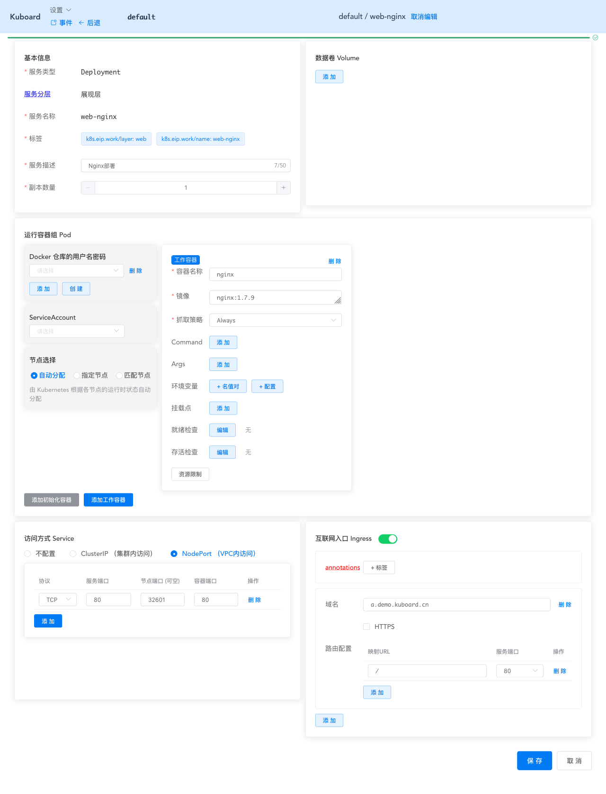

# Ingress通过互联网访问您的应用

<AdSenseTitle/>

参考文档：
* Kubernetes 官网 [Ingress](https://kubernetes.io/docs/concepts/services-networking/ingress/)
* Kubernetes 官网 [Ingress Controllers](https://kubernetes.io/docs/concepts/services-networking/ingress-controllers/)
* Kubernetes Nginx Ingress Controller [Bare-metal considerations](https://kubernetes.github.io/ingress-nginx/deploy/baremetal/)
* nginxinc/kubernets-ingress [kubernetes-ingress](https://github.com/nginxinc/kubernetes-ingress)

## Ingress

Ingress 是 Kubernetes 的一种 API 对象，将集群内部的 Service 通过 HTTP/HTTPS 方式暴露到集群外部，并通过规则定义 HTTP/HTTPS 的路由。Ingress 具备如下特性：集群外部可访问的 URL、负载均衡、SSL Termination、按域名路由（name-based virtual hosting）。

Ingress Controller （通常需要负载均衡器配合）负责实现 Ingress API 对象所声明的能力。如下图所示：

1. Ingress Controller 监听所有 worker 节点上的 80/443 端口
2. Ingress Controller 将所有对域名为 a.kuboard.cn 的 HTTP/HTTPS 请求路由到 Service B 的 9080 端口
3. Service B 将请求进一步转发到其标签所选择的 Pod 容器组（通过 targetPort 指定容器组上的端口号）

该图中，**请求被转发的过程为：**

0. 假设您将 a.kuboard.cn 的 DNS 解析到了集群中的一个 worker 节点的 IP 地址 `192.168.2.69`。（如果您的 worker 节点有外网地址，请使用外网地址，这样您可以从外网访问您的服务）
1. 从客户端机器执行命令 `curl http://a.kuboard.cn/abc/`，该请求您将被转发到 `192.168.2.69` 这个地址的 80 端口，并被 Ingress Controller 接收
2. Ingress Controller 根据请求的域名 `a.kuboard.cn` 和路径 `abc` 匹配集群中所有的 Ingress 信息，并最终找到 `Ingress B` 中有这个配置，其对应的 Service 为 `Service B` 的 `9080` 端口
3. Ingress Controller 通过 kube-proxy 将请求转发到 `Service B` 对应的任意一个 Pod 上 与 `Service B` 的 `9080` 端口对应的容器端口上。（从 Ingress Controller 到 Pod 的负载均衡由 kube-proxy + Service 实现）

<p style="max-width: 720px;">
</img>
</p>

## Ingress Controller

如上所述，您必须在 Kubernetes 集群中安装了 Ingress Controller，您配置的 Ingress 才能生效。

::: tip 划重点

Ingress 只是 Kubernetes 中的一种配置信息；Ingress Controller 才是监听 80/443 端口，并根据 Ingress 上配置的路由信息执行 HTTP 路由转发的组件。

:::

Ingress Controller 有多种实现可供选择，请参考 Kubernetes 官方文档 [Additional controllers](https://kubernetes.io/docs/concepts/services-networking/ingress-controllers/#additional-controllers)，比较常用的有 [Traefic](https://github.com/containous/traefik) 、 [Nginx Ingress Controller for Kubernetes](https://www.nginx.com/products/nginx/kubernetes-ingress-controller) 等。

如果您参考 https://kuboard.cn 网站上提供的文档安装了 Kubernetes，您应该已经完成了 [Nginx Ingress Controller for Kubernetes](https://www.nginx.com/products/nginx/kubernetes-ingress-controller) 在您 Kubernetes 集群中的安装。该 Ingress Controller 以 DaemonSet 的类型部署到 Kubernetes，且监听了 hostPort 80/443，YAML 片段如下所示：

> 如果您打算使用其他 Ingress Controller，您可以 [卸载 Nginx Ingress Controller](/install/install-k8s.html#安装-ingress-controller)；如果您尚未安装任何 Ingress Controller，请参考 [安装 Nginx Ingress Controller](/install/install-k8s.html#安装-ingress-controller)，以便可以完成本教程的后续内容。

``` yaml {2,23,26}
apiVersion: extensions/v1beta1
kind: DaemonSet
metadata:
  name: nginx-ingress
  namespace: nginx-ingress
	# ...
spec:
  selector:
    matchLabels:
      app: nginx-ingress
  template:
    metadata:
      labels:
        app: nginx-ingress
    spec:
      serviceAccountName: nginx-ingress
      containers:
      - image: nginx/nginx-ingress:1.5.3
        name: nginx-ingress
        ports:
        - name: http
          containerPort: 80
          hostPort: 80
        - name: https
          containerPort: 443
          hostPort: 443
```


::: tip

* Ingress Controller 并非只能监听 80/443 端口，您可以根据自己网络拓扑的需要，选择合适的端口
* 根据您安装 Ingress Controller 的方式不同，您的 Ingress Controller 并不一定监听了所有 worker 节点的 80/443 端口（本教程不涉及此主题）
* 您也可以在 Kubernetes 集群中安装多种 Ingress Controller，请参考 [Using multiple Ingress controllers](https://kubernetes.io/docs/concepts/services-networking/ingress-controllers/#using-multiple-ingress-controllers)

:::

## 融入到网络拓扑中

如前所述，Kubernetes Ingress 只能监听到节点的 80/443 端口，且 Ingress 可以完成 L7 路由的功能。由于 Kubernetes Ingress 配置更便捷，推荐使用 Kubernetes Ingress 替代常规的互联网应用架构中的 Nginx 反向代理。那么，如何使部署在内网的 Kubernetes 集群上的 Ingress Controller 的 80/443 端口可以在外网访问到呢？

本教程推荐如下两种做法，结合您自己对安全性、可靠性等因素的考量，您可以演化出适合自己的拓扑结构。

### 暴露单worker节点

如下图所示，暴露单个 worker 节点的步骤如下：

* 为您 Kubernetes 集群中的某一个 worker 节点配置外网 IP 地址 Z.Z.Z.Z
* 将您在 Ingress 中使用到的域名（假设是`a.demo.kuboard.cn`）解析到该外网 IP 地址 Z.Z.Z.Z
* 设置合理的安全组规则（开放该外网 IP 地址 80/443 端口的入方向访问）

> 文档 [安装 Kubernetes 单Master节点](/install/install-k8s.html) 中使用的就是这种拓扑结构。这种方式下，Ingress Controller 存在单点故障的可能性。


### 使用外部负载均衡器

如下图所示，使用外部负载均衡器的步骤如下：

* 创建一个集群外部的负载均衡器，该负载均衡器拥有一个外网 IP 地址 Z.Z.Z.Z，并监听 80/443 端口的 TCP 协议
* 将负载均衡器在 80/443 端口上监听到的 TCP 请求转发到 Kubernetes 集群中所有（或某些）worker 节点的 80/443 端口，可开启按源IP地址的会话保持
* 将您在 Ingress 中使用到的域名（假设是`a.demo.kuboard.cn`）解析到该负载均衡器的外网 IP 地址 Z.Z.Z.Z

> 文档 [安装 Kubernetes 高可用](/install/install-kubernetes.html) 中使用的就是这种拓扑结构。


## 实战：通过 Ingress 使您的应用程序在互联网可用

<SharingBlock>

::: warning 前提
* 假设您已经完成了 [公布应用程序](/learning/k8s-basics/expose.html) 中的实战部分
* 假设您已经将 Ingress 融入到您的网络拓扑中，并且将 `*.demo.kuboard.cn` （请使用您自己的域名）解析到对应的外网 IP 地址
:::

<el-tabs type="border-card">
<el-tab-pane label="使用kubectl">

**创建文件 nginx-deployment.yaml**
``` sh
vim nginx-deployment.yaml
```

**文件内容如下**

``` yaml
apiVersion: apps/v1
kind: Deployment
metadata:
  name: nginx-deployment
  labels:
    app: nginx
spec:
  replicas: 1
  selector:
    matchLabels:
      app: nginx
  template:
    metadata:
      labels:
        app: nginx
    spec:
      containers:
      - name: nginx
        image: nginx:1.7.9
```

**创建文件 nginx-service.yaml**
``` sh
vim nginx-service.yaml
```

**文件内容如下**

``` yaml
apiVersion: v1
kind: Service
metadata:
  name: nginx-service
  labels:
    app: nginx
spec:
  selector:
    app: nginx
  ports:
  - name: nginx-port
    protocol: TCP
    port: 80
    nodePort: 32600
    targetPort: 80
  type: NodePort
```

**创建文件 nginx-ingress.yaml**
``` sh
vim nginx-ingress.yaml
```

**文件内容如下**

``` yaml
apiVersion: networking.k8s.io/v1beta1
kind: Ingress
metadata:
  name: my-ingress-for-nginx  # Ingress 的名字，仅用于标识
spec:
  rules:                      # Ingress 中定义 L7 路由规则
  - host: a.demo.kuboard.cn   # 根据 virtual hostname 进行路由（请使用您自己的域名）
    http:
      paths:                  # 按路径进行路由
      - path: /
        backend:
          serviceName: nginx-service  # 指定后端的 Service 为之前创建的 nginx-service
          servicePort: 80
```


**执行命令**

``` sh
kubectl apply -f nginx-deployment.yaml
kubectl apply -f nginx-service.yaml
kubectl apply -f nginx-ingress.yaml
```

**检查执行结果**

``` sh
kubectl get ingress -o wide
```

可查看到名称为 my-ingress-for-nginx 的 Ingress。

**从互联网访问**

``` sh
# 请使用您自己的域名
curl a.demo.kuboard.cn
```

</el-tab-pane>
<el-tab-pane label="使用Kuboard">

* 在 default 名称空间 点击 ***创建工作负载***

    填写表单如下：

    | 字段名称   | 填写内容                                                     | 备注                                                         |
    | ---------- | ------------------------------------------------------------ | ------------------------------------------------------------ |
    | 服务类型   | Deployment                                                   |                                                              |
    | 服务分层   | 展现层                                                       |                                                              |
    | 服务名称   | web-nginx                                                    |                                                              |
    | 服务描述   | nginx部署                                                    |                                                              |
    | 副本数量   | 1                                                            | 可以填写其他正整数                                           |
    | 工作容器   | 容器名称：nginx<br />镜像：nginx:1.7.9<br />抓取策略：Always |                                                              |
    | 访问方式   | NodePort（VPC内访问）<br />协议: TCP，服务端口: 80，节点端口: 32601，容器端口: 80 | 访问方式对应 Kubernetes Service对象，<br />工作负载编辑器为其使用与 Deployment 相同的名字 web-nginx |
    | 互联网入口 | 域名: a.demo.kuboard.cn<br />映射URL： /<br />服务端口：80   | 互联网入口对应 Kubernetes Ingress对象，<br />工作负载编辑器为其使用与 Deployment 相同的名字 web-nginx |

    

* **如下图所示：**



::: tip
Kuboard 工作负载编辑器将 kubernetes 中三个主要对象 Deployment/Service/Ingress 放在同一个编辑器界面中处理。
:::

* 点击 **保存**

* 点击 **应用**

* **从互联网访问**

  在浏览器打开 `http://a.demo.kuboard.cn` （请使用您自己的域名）

</el-tab-pane>
</el-tabs>


</SharingBlock>
