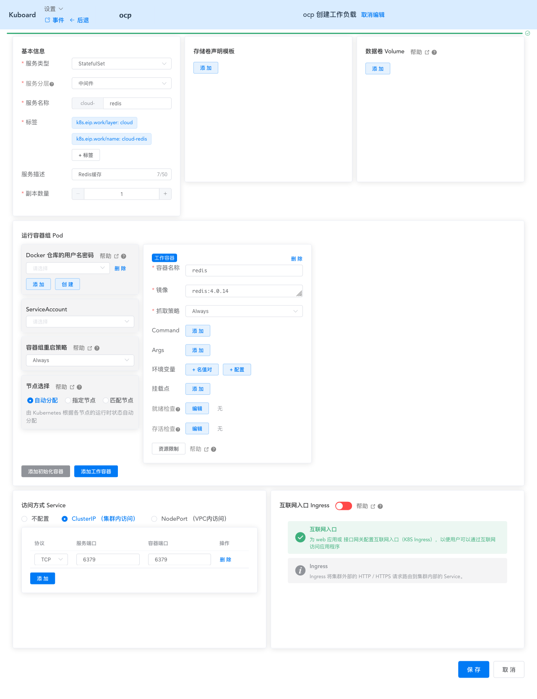
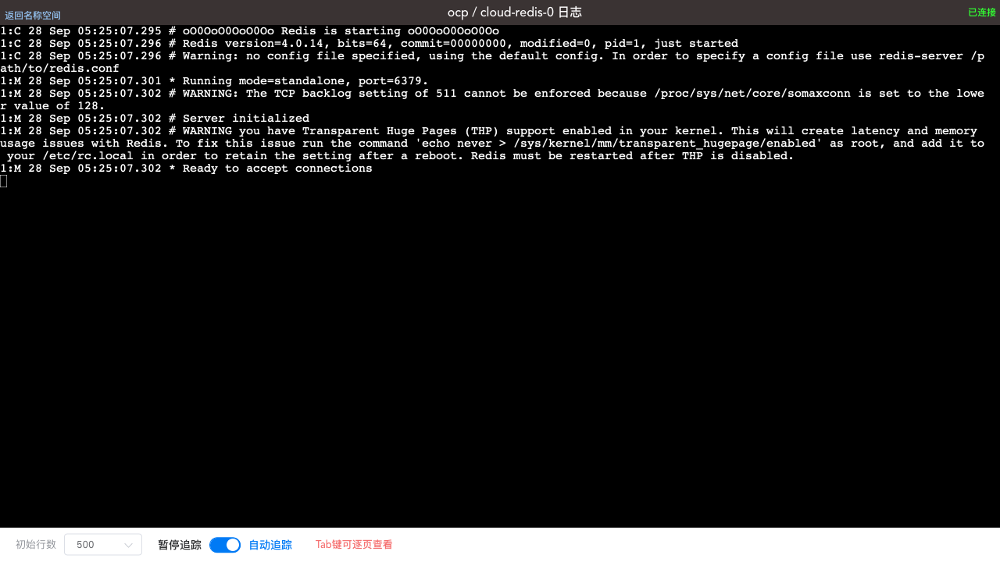

# 在K8S上部署redis

如 [在K8S上部署mysql](./mysql.html) 所述，auth-center、user-center、api-gateway 都需要使用 redis 服务，本文描述如何使用 Kuboard 在 Kubernetes 上部署 redis。

本文将使用 [redis官方镜像](https://hub.docker.com/_/redis) 进行部署。

## 部署redis

* 在 Kuboard 界面进入名称空间 `ocp`，点击 **创建工作负载** 按钮，并填写表单，如下图所示：

  | 字段名称 | 填写内容                                                     | 备注 |
  | -------- | ------------------------------------------------------------ | ---- |
  | 服务类型 | StatefulSet                                                  |      |
  | 服务分层 | 中间件                                                       |      |
  | 服务名称 | redis                                                        |      |
  | 服务描述 | Redis缓存                                                    |      |
  | 容器名称 | redis                                                        |      |
  | 镜像     | redis:4.0.14                                                 |      |
  | 抓取策略 | Always                                                       |      |
  | Service  | ClusterIP（集群内访问）<br />协议：`TCP` 端口： `6379` 容器端口：`6379` |      |


  

* 点击 **保存**

* 点击 **应用**

* 点击 **完成**

  稍等片刻，即可完成 redis 的部署

## 检查redis

* 在 Kuboard 界面进入 `cloud-redis-0` 容器组的日志界面，可查看到 redis 可用的输出信息，如下所示：

  ```sh
  1:M 28 Sep 05:25:07.302 * Ready to accept connections
  ```

  

* :tada: :tada: :tada: 您已在 K8S 上完成了 Redis 的部署

  ::: tip 集群
  www.kuboard.cn 将另外安排文章描述如何在 Kubernetes 上部署 Redis 的集群。此处为了保持 Spring Cloud 部署教程的简洁性，使用单节点 Redis
  :::
