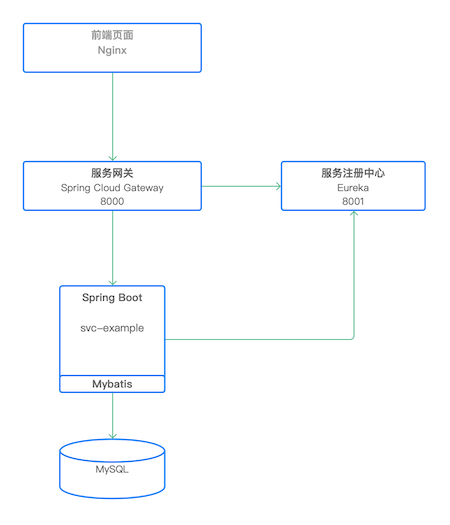

# Spring Cloud on Kubernetes

下图是作者在落地 Spring Cloud 微架构的过程中，设计了如下图所示的微服务参考架构，设计和研发 Kuboard 的初心便源于此图。历时两年时间，Kuboard终于发布，也标志着该参考架构的成熟可用。该参考架构主要包括四个重要组成部分：

* 微服务运行时
  * 前后端分离
  * Spring Cloud
* 构建及测试
  * 源代码/构建管理
  * 包管理
* 部署及运维
  * Kubernetes + Kuboard
* 监控及评估
  * 熔断及限流
  * 链路追踪
  * 性能监控
  * 日志收集
  * APM

在整体架构中，微服务运行时分为如下几层：
  * 展现层
  * 网关层
  * 服务层
  * 中间件层

另有监控层，用于微服务运行时的监控和评估。

展现层、网关层、服务层、中间件层以及监控层，都运行于 Kubernetes 之上，由 Kuboard 管理。

Spring Cloud on Kubernetes 并不对 Spring Cloud 架构、组件等做过多解释，而是将重点放在如何将 Spring Cloud 的各类型组件顺利部署到 Kubernetes 环境中。

为了更好地阐述此主题，作者准备了一个最简单的微服务 example 作为例子，该 example 只实现了对一张简单数据库表执行 CRUD 操作的功能，该 example 的部署架构如下图所示，源代码请参考 [kuboard-example](https://github.com/eip-work/kuboard-example)，您也可以直接通过 Kuboard [导入 example 微服务](/guide/example/import.html)

