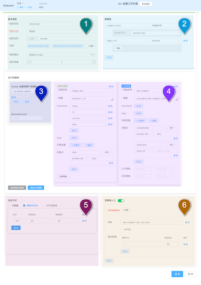
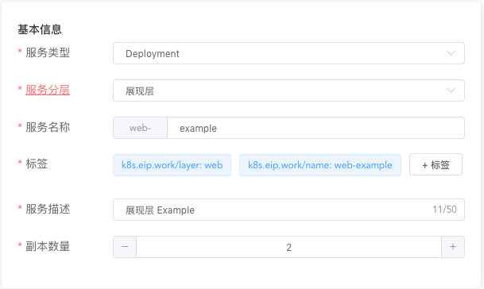
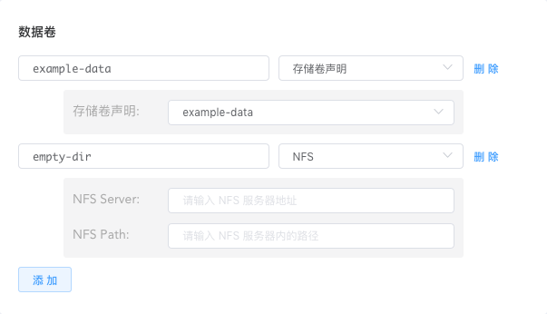
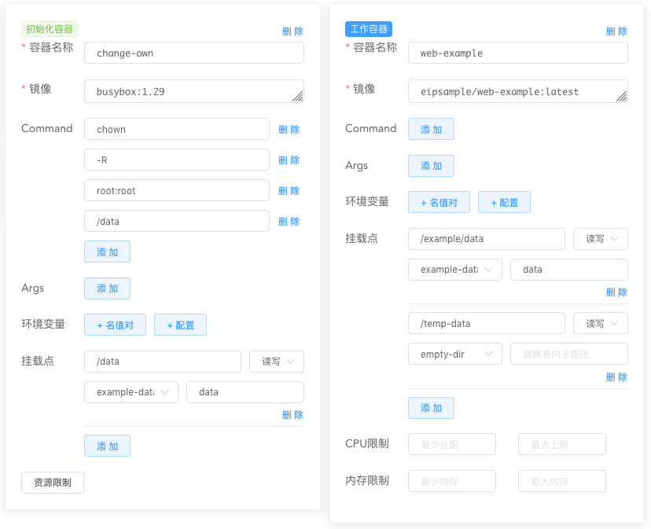

# 如何降低Kubernetes学习门槛

## Kubernetes 学习门槛在哪儿

学习 Kubernetes 之前，必须具备的知识储备：

* Linux 基础
* 网络基础
* 容器技术，例如 https://www.docker.com/

学习 Kubernetes 的过程中可能碰到的难关：

* 理解 Kubenetes 为了实现容器编排而提出的各种抽象概念以及他们之间的关系：容器组（Pod）、存储卷（Volume）、存储卷声明（PVC）、Ingress、Service 等
* 安装及配置 Kubernetes 环境
* 编写和维护 Kubernetes Yaml 文件
* 熟悉 kubectl 命令行工具中常用的 10 多个命令

## 降低 Kubernetes 学习门槛

### 学习路线

单纯地按章节学习 Linux 基础知识、网络知识、容器技术等，每一块儿的基础入门书籍就有几百页之多。作者认为，最好的学习方法是在实践中学习，碰到问题时去寻求答案，解决问题后去反思总结。这种学习方法趣味性强，得来的知识也最为牢靠，如果选对了方向，所学知识通常也是工作中实用性最高的知识。读了100页 K8S 文档，也不如安装一遍 K8S

Kuboard 为初学者学习 Kubernetes 时设计了如下学习路径：

* 跟随文档 [安装 Kubernetes 单Master节点](/install/install-k8s.html) 快速安装一个可以练习使用的 Kubernetes 环境，（初学者也许要花费2小时或更多）
* 跟随文档 [安装 Kuboard](/install/install-dashboard.html) （5分钟）
* 使用 Kuboard 工作负载编辑器 [创建 busybox](/guide/example/busybox.html) （10分钟）
* 尝试 Kuboard 设计的其他 example [使用 Kuboard](/guide/index.html)

进阶路线：
* 在 Kubernetes 中部署 Spring Cloud 微服务应用

### 快速入门

​		在向 Kubernetes 集群部署应用时，开发者或者运维团队必须花大量的时间去理解 Kubernetes 中各种对象的概念，并编写 Yaml 文件去描述 Kubernetes 对象以及他们之间的关系，然而，不同的人因为经验、视角的不同，对Kubernetes 中各对象之间关系的理解并不完全一致，也因此产生了一系列问题：

* 由于理解的不到位，刚入门Kubernetes的技术人员在使用 Kubernetes 部署应用时经常性地受挫；
* 由于理解方式的不一致，不同技术人员编写的 yaml 文件结构各不一样，降低了部署在后期的可维护性；
* 由于部署数量的增加，导致 YAML 文件的数量和代码行数不断增长；

​		Kubernetes 官方提供的 Kubernetes Dashboard 充分意识到了 Kubernete 对象类型在种类上的多样性以及关系上的复杂性，到目前为止并没有在全功能 Dashboard 上做出过多努力，尤其是没有付出过多努力去打造工作负载的 UI 编辑器。在 Kubernetes Dashboard 中，如果想要对 Service、Deployment、StatefulSet、ConfigMap 等各种 Kubernetes 对象执行新增或者变更操作时，您必须编写 YAML 文件。从这个意义上来讲，截止到作者写这篇文章的时间点，Kubernetes 的官方 Dashboard 仍然是一个 “只读” 型 Dashboard，几乎所有的运维操作仍然需要技术人员去编写和维护冗长的 YAML 文件，并通过 kubectl 命令来完成。

​		由于 Kubernetes YAML 文件复杂性，以及开发/运维团队在多环境复制（开发环境、测试环境、准上线环境、生产环境等）方面的普遍需求，Kubernetes 社区提出了各种各样的解决方案，例如 kustomize / helm chart 等，这些解决方案在解决一个问题的同时，又在另一方面增加了复杂度，为 Kubernetes 爱好者增加了新的学习门槛。

## 入门利器

为了降低 Kubernetes 的学习难度和使用难度，Kuboard 对 Kubernetes 中管理的各种对象做了一个梳理，并以此为基础，设计了 Kuboard 工作负载编辑器。

Kuboard 工作负载编辑器以下图的方式理解和管理 Kubernetes 对象。

上图中各概念与 Kuboard 工作负载编辑器界面的映射关系如下：

### 1. 基本信息

基本信息对应到 Kubernetes 的 Workload Controller，当前 Kuboard 工作负载编辑器已经支持了使用频率最高的几类 Workload Controller ：

* Deployment
* StatefulSet
* DaemonSet

> Kuboard 将陆续支持其他低频使用的 Controller:  Garbage Collection, TTL Controller, Jobs, Cron Job。

Kubernetes Workload Controller 主要用于：

* 根据容器组模板的定义，创建和管理多个容器组
* 处理容器组的复制和上线
* 在集群范围内提供自修复能力

> 例如：Workload Controller 起初在节点 A 上创建并运行了一个容器组 pod_a，当节点 A 出现故障不能正常工作时，Workload Controller 可以自动地在其他可用的节点上运行一个完全相同的容器组实例 pod_a' 以替代 pod_a。
>
> 不同类型的 Workload Controller 在处理容器组时，会有各自不同的行为。

> 请参考 https://kubernetes.io/docs/concepts/workloads/pods/pod-overview/#pods-and-controllers

基本信息编辑器的界面如下图所示：

| 字段名称 | 字段描述                                                     |
| -------- | ------------------------------------------------------------ |
| 服务类型 | 即工作负载类型， 当前支持： Deployment、StatefulSet、DaemonSet |
| 服务分层 | 决定了 Kuboard 将该工作负载展示在哪一个分层，同时，也确定了该工作负载名称的前缀，可选项有： * 展现层 web、网关层 gateway、服务层 svc、持久层 db、中间件层 cloud、监控层 monitor； * 默认层当前不可选择 |
| 标签     | 用于确定 Service 的 labelSelector、Controller 的 labels、容器组的 labels |
| 服务描述 | 展示在 Kuboard 界面上的一段描述信息                          |
| 副本数量 | 对于 Deployment 和 StatefulSet 可以填写，决定了该控制器应该维持的容器组副本的数量 |

### 2. 数据卷

​		容器每次启动时，从镜像中初始化所有文件，后续对文件系统的修改、新增、删除操作的结果都是不能持久化的。当容器崩溃时， kubelet 重启该容器，但是原容器已经做的修改将丢失，因为每次启动容器，都是从镜像中初始化；此外，多个容器运行在同一个容器组中时，通常伴随着在不同容器之间共享文件的需求。

​		Kubernetes的抽象出了数据卷 Volume 的概念，以解决上述的问题。

​		**Kuboard 目前支持如下类型的数据卷：**

* NFS
* 存储卷声明
* emptyDir
* 配置 ConfigMap
* Secrets

> Kubernetes 支持的数据卷类型，请参考：https://kubernetes.io/docs/concepts/storage/volumes/#types-of-volumes
>
> Kuboard 认为当前支持的数据卷类型已经满足绝大多数应用场景，目前正在添加对更多类型数据卷的支持。

​		容器组中的不同容器都可以通过挂载点引用该容器组加载的数据卷。Kuboard 工作负载编辑中，使用如下界面定义数据卷：

| 字段名称       | 说明                                                         |
| -------------- | ------------------------------------------------------------ |
| 数据卷名称     | 如图中的 ***example-data*** 、 ***empty-dir***               |
| 数据卷类型     |                                                              |
| 数据卷详细信息 | 不同类型的数据卷需要填写的信息不尽相同，例如 存储卷声明，需要选择事先已经在名称空间中创建好的存储卷声明 NFS，需要填写 NFS Server 的地址，以及 NFS Path |

### 3. 身份信息

身份信息区域主要为容器组定义两类信息：

* imagePullSecrets，容器组调用镜像仓库接口抓取镜像时所使用的用户名密码。如果您使用了私有镜像仓库，您需要在此指定镜像仓库的用户名密码；如果您使用 docker 公共仓库，则无需填写 imagePullSecrets
* ServiceAccount，容器组调用 kubernetes apiserver 时，所使用的身份信息

Kuboard 工作负载编辑器中关于身份信息的编辑界面如下所示：

### 4. 容器

容器是我们真正应用程序镜像被加载和运行的地方，按照 Kubernetes 的设计，一个容器组 Pod 中可以包含多个容器 Container，这些容器被分为两类：

* 初始化容器
  * 初始化容器总是执行后结束执行
  * 初始化容器按其定义的顺序执行，前一个初始化容器执行结束后，才开始后一个初始化容器的执行
  * 只有初始化容器执行成功后，容器组才启动工作容器
  * 请参考 https://kubernetes.io/docs/concepts/workloads/pods/init-containers/
* 工作容器
  * 容器组可以包含一个或多个工作容器
  * https://kubernetes.io/docs/concepts/workloads/pods/pod-overview

Kuborad中，定义容器的界面如下图所示：

### 5. 访问方式

​		访问方式，即 Kubernetes Service。

> 请参考： https://kubernetes.io/docs/concepts/services-networking/service/

​		Kuboard 中，支持 ClusterIP（集群内访问） 以及 NodePort（VPC 内访问） 两种 Service 访问方式，您也可以不为该工作负载定义 Service 访问方式。访问方式的界面如下所示：

### 6. 互联网入口

​		互联网入口，即 Kubernetes Ingress。

> 请参考： https://kubernetes.io/docs/concepts/services-networking/ingress/

​		Kuboard 并不限定您使用何种类型的 [Ingress Controller](https://kubernetes.io/docs/concepts/services-networking/ingress-controllers/)， 但是 [安装 Kubernetes 用于测试](/install/install-k8s) 文档中，推荐使用的 Ingress Controller 是 [Nginx-Ingress](https://github.com/nginxinc/kubernetes-ingress)。

​		在您使用 Nginx-Ingress 的情况下，要想确保您能按照互联网入口中定义的域名访问您的服务，请确保以下两点：

* 域名解析指向 Kubernetes 集群中 Worker 节点对应的负载均衡的 IP 地址
  * 如果是测试环境，也可以只指向其中一台 Worker 节点的 IP 地址
* 通过该域名，可以访问 Worker 节点的 80 端口
  * 如果您启用了 HTTPS，请同时确保通过该域名可以访问 Worker 节点的 443 端口

​		Kuboard 中，定义互联网入口的界面如下所示：

