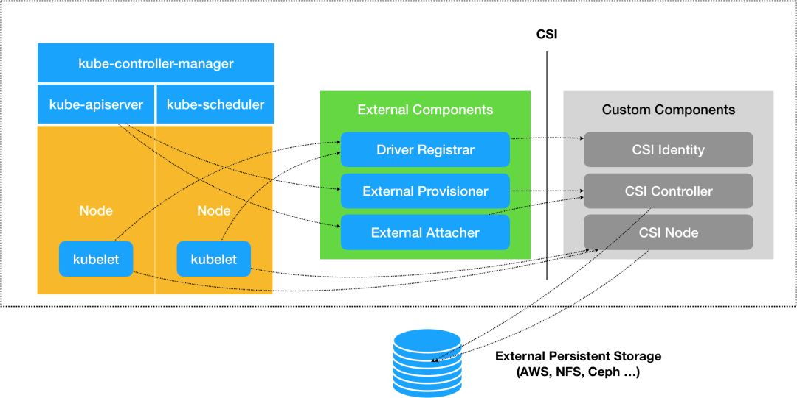
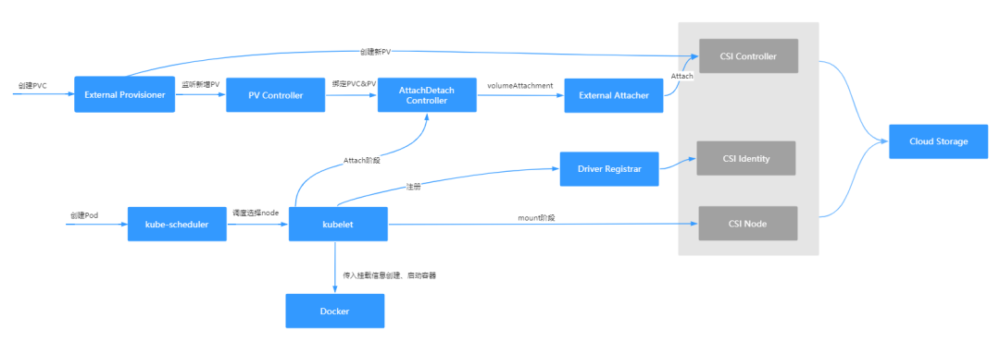

# CKA每日一题 --- Day 2

<AdSenseTitle/>

**今日考题**

在Kubernetes PVC+PV 体系下通过 CSI 实现的 volume plugins 动态创建 pv 到 pv 可被 pod 使用有哪些组件需要参与？

A. PersistentVolumeController + CSI-Provisoner + CSI controller plugin

B. AttachDetachController + CSI-Attacher + CSI controller plugin

C. Kubelet + CSI node plugin

<b-button v-b-toggle.collapse-join-error variant="danger" size="sm" style="margin-top: 1rem;" v-on:click="$sendGaEvent('cka-daily', 'cka-daily', 'CKA每日一题001')">答案及解析</b-button>
<b-collapse id="collapse-join-error" class="mt-2">
<b-card style="background-color: rgb(254, 240, 240); border: solid 1px #F56C6C;">

**答案： A、B、C**

k8s中，利用PVC 描述Pod 所希望使用的持久化存储的大小，可读写权限等，一般由开发人员去创建；利用PV描述具体存储类型，存储地址，挂载目录等，一般由运维人员去提前创建。而不是直接在pod里写上volume的信息。一来可以使得开发运维职责分明，二来利用PVC、PV机制，可以很好扩展支持市面上不同的存储实现，如k8s v1.10版本对Local Persistent Volume的支持。

**我们试着理一下Pod创建到volume可用的整体流程。**

用户提交请求创建pod，PersistentVolumeController发现这个pod声明使用了PVC，那就会帮它找一个PV配对。

没有现成的PV，就去找对应的StorageClass，帮它新创建一个PV，然后和PVC完成绑定。

新创建的PV，还只是一个API 对象，需要经过“**两阶段处理**”，才能变成宿主机上的“持久化 Volume”真正被使用：

**第一阶段**由运行在master上的AttachDetachController负责，为这个PV完成 Attach 操作，为宿主机挂载远程磁盘；

**第二阶段**是运行在每个节点上kubelet组件的内部，把第一步attach的远程磁盘 mount 到宿主机目录。这个控制循环叫VolumeManagerReconciler，运行在独立的Goroutine，不会阻塞kubelet主控制循环。

完成这两步，PV对应的“持久化 Volume”就准备好了，POD可以正常启动，将“持久化 Volume”挂载在容器内指定的路径。

k8s支持编写自己的存储插件FlexVolume 与 CSI。不管哪种方式，都需要经过“两阶段处理”，FlexVolume相比CSI局限性大，一般我们采用CSI方式对接存储。

CSI 插件体系的设计思想把这个Provision阶段（动态创建PV），以及 Kubernetes 里的一部分存储管理功能，从主干代码里剥离出来，做成了几个单独的组件。这些组件会通过 Watch API 监听 Kubernetes 里与存储相关的事件变化，比如 PVC 的创建，来执行具体的存储管理动作。

上图中CSI这套存储插件体系中三个独立的外部组件（External Components），即：Driver Registrar、External Provisioner 和 External Attacher，对应的是从 Kubernetes 项目里面剥离出来的部分存储管理功能。

我们需要实现Custom Components这一个二进制，会以gRpc方式提供三个服务：CSI Identity、CSI Controller、CSI Node。

Driver Registrar 组件，负责将插件注册到 kubelet 里面；Driver Registrar调用CSI Identity 服务来获取插件信息；External Provisioner 组件监听APIServer 里的 PVC 对象。当一个 PVC 被创建时，它就会调用 CSI Controller 的 CreateVolume 方法，创建对应 PV；

External Attacher 组件负责Attach阶段。Mount阶段由kubelet里的VolumeManagerReconciler控制循环直接调用CSI Node服务完成。

两阶段完成后，kubelet将mount参数传递给docker，创建、启动容器。

**整体流程如下图：**

</b-card>
</b-collapse>
